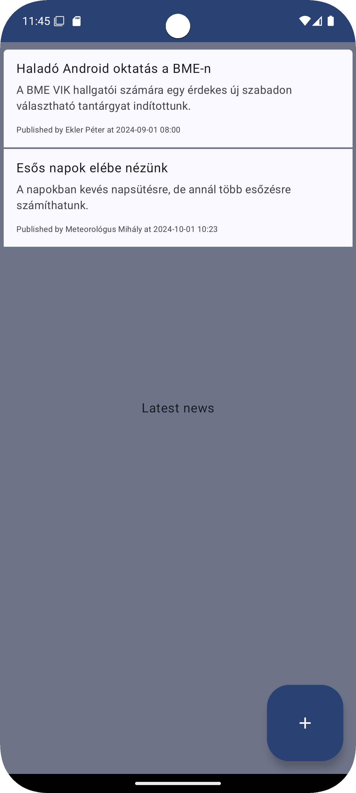
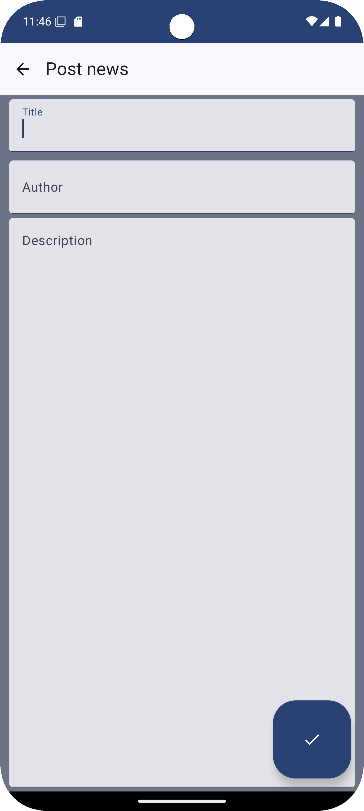

# Labor 2 - News

A második laborban egy közösségi hírportált készítünk az architekturális kérdésekre koncentrálva. A hírportál egy
kiadott backenddel kommunikál. A backendhez bárki szabadon beküldhet rövid híreket, amelyeket az alkalmazás megjelenít.
Fontos, hogy az alkalmazást az architekturára vonatkozó best practice-ek szerint készítsük el, illetve hogy az
alkalmazás képes legyen offline működésre is. Az alkalmazás kódminősége az architekturális szempontokon túl is
fontos, ezért ktlint plugint is engedélyezni fogunk, illetve konfigurálunk tesztlefedettségi riportokat is.

A feladat során az alábbi technológiákkal fogunk találkozni:

*   Modern App Architecture
*   ViewModel
*   Dependency Injection
*   OpenAPI
*   Ktlint
*   Room

Az alkalmazásban mindössze két lényeges felület lesz. A főképernyőn a legutóbbi hírek láthatóak beküldésük
szerint csökkenő sorrendben. Minden hírhez megjelenik a címe, szövege, a beküldő neve és a beküldés ideje.
A képernyő rövid időközönként automatikusan frissül. A képernyőn levő floating action buttonra kattintva pedig
egy másik képernyő jelenik meg, ahol újabb hírt küldhetünk be.

<p align="center">


</p>


## Előkészületek

A feladatok megoldása során ne felejtsd el követni a [feladat beadása folyamatát](../../tudnivalok/github/GitHub).

### Git repository létrehozása és letöltése

1. Moodle-ben keresd meg a laborhoz tartozó meghívó URL-jét és annak segítségével hozd létre a saját repository-dat.

1. Várd meg, míg elkészül a repository, majd checkout-old ki.

    !!! tip ""
        Egyetemi laborokban, ha a checkout során nem kér a rendszer felhasználónevet és jelszót, és nem sikerül a checkout, akkor valószínűleg a gépen korábban megjegyzett felhasználónévvel próbálkozott a rendszer. Először töröld ki a mentett belépési adatokat (lásd [itt](../../tudnivalok/github/GitHub-credentials.md)), és próbáld újra.

1. Hozz létre egy új ágat `megoldas` néven, és ezen az ágon dolgozz.

1. A `neptun.txt` fájlba írd bele a Neptun kódodat. A fájlban semmi más ne szerepeljen, csak egyetlen sorban a Neptun kód 6 karaktere.

## Projekt megnyitása

Az alkalmazás váza már adott a `News` könyvtárban. Nyissuk meg a könyvtárat az Android Studióval.

### Első feladat: az alkalmazás áttekintése, a backend indítása

Tekintsük át az alkalmazás kódját! Az alkalmazás eleve a Modern App Architecture elvek szerint készült, de még hiányoznak bizonyos
funkciói, például nem távolról kéri el a híreket, hanem beégetett listát tartalmaz. Ahhoz, hogy a tényleges hálózati
kommunikációt megvalósítsuk, először el kell indítanunk a backendet. A backend a feladat repository-jában, a `news-backend`
könyvtárban található, és többféleképpen indítható. Ha Docker nélkül indítjuk, akkor JDK 17 vagy újabb szükséges hozzá.
A backend egy gradle projekt, és gradle wrappert is tartalmaz, így a könyvtárban parancssorral könnyen indítható.
Windowson:

```.\gradlew.bat bootRun```

Linuxon és Macen:

```./gradlew bootRun```

Vagy ha ismerős számunkra a Docker, akkor a projekt gyökerében elhelyezett `Dockerfile` segítségével készíthetünk egy
image-et, amit futtatva elindul a backend. Ha így indítod, ügyelj rá, hogy a 8080-as belső portot mappeld a hosztgép
8080-as portjára!

Végezetül egy harmadik lehetőség, hogy ha ismerős számunkra a Java (Kotlin) alapú backendfejlesztés, akkor a projektet
egy fejlesztőkörnyezetben (IntelliJ, Eclipse, VS Code) megnyitva is futtathatjuk a projektet.

A backend mindenképp a 8080-as porton indul, és generálódik hozzá egy OpenAPI leírás is, valamint elindul a Swagger UI
grafikus megjelenítő, ahol a végpontokat egy áttekinthető grafikus felületen is megnézheted. Ezt itt éred el:
http://localhost:8080/swagger-ui/index.html

A szabványos OpenAPI leírás végpontja pedig: http://localhost:8080/v3/api-docs

Vizsgáljuk meg az OpenAPI leírást! A backendben két végpont van, egyik a hírek listázására szolgál, és itt opcionálisan
megadható egy idő is, hogy mely időponttól szeretnénk listázni az új híreket. A másik végpont új hír felvitelére szolgál.
A Swagger UI-ban ki is próbálatod a végpontokat.

Vigyél fel egy hírt, amelynek Te vagy a szerzője, majd listázd a híreket!

!!!example "BEADANDÓ (1 pont)"
    Készíts képernyőképet (f1.png) róla, hogy fut a backend, és visszaadta a hírek listáját, benne az általad felvett hírrel!

Fontos: a backend csak a futásának ideje alatt őrzi meg a felvitt híreket, ha újraindítod, akkor a korábban elmentett
hírek elvesznek.

### Második feladat: OpenAPI alapú kódgenerálás

Az első lépés abba az irányba, hogy képesek legyünk a backenddel kommunikálni az, hogy elkészítjük a klienskódot a
backend meghívásához. Ezt megtehetjük bármelyik népszerű könyvtár segítségével (pl. Retrofit), de most ki fogjuk
használni, hogy a backendhez elérhető egy OpenAPI specifikáció.

Először töltsük le backend által generált OpenAPI leírást. Ennek elhelyezésére nincs konvencionálisan elfogadott könyvtár,
most készítsünk neki egy `src/main/openapi` könyvtárat! Viszont mivel ez nem konvencionálisan használt könyvtár, ezért
az Android Studióban át kell váltanunk `Android` nézetről `Project files` nézetre, hogy lássuk a valós könyvtárakat.
Hozzunk létre itt egy fájlt `api.json` néven, és tegyük be ebbe az API-leírást! Fontos, hogy a hosztgépünket az Android
emulátorból a `10.0.2.2` IP-címen érhetjük el, ezért módosítsuk az API-leírás `servers` szekcióját:

```json
"servers": [
{
  "url": "http://10.0.2.2:8080",
  "description": "Generated server url"
}
],
```

Mivel az alkalmazásunk Internetet is fog használni, vegyük fel a Manifest-fájlba a megfelelő engedélyt:

```xml
<uses-permission android:name="android.permission.INTERNET" />
```

A következő lépés, hogy az OpenAPI plugint fel kell vennünk a projektbe. A projektszintű `build.gradle.kts` fájlba
vegyük fel először, de itt még ne alkalmazzuk:

```kotlin
id("org.openapi.generator") version "7.8.0" apply false
```

Majd a modulszintű `build.gradle.kts` fájlban alkalmazzuk is:

```kotlin
id("org.openapi.generator")
```

Majd szintén ebbe a fájlba vegyük fel a generátor konfigurációját is:

```kotlin
openApiGenerate {
    generatorName.set("kotlin")
    inputSpec.set("${projectDir.path}/src/main/openapi/api.json")
    outputDir.set("${layout.buildDirectory.asFile.orNull}/generated/openapi")
    apiPackage.set("hu.bme.aut.news.api")
    modelPackage.set("hu.bme.aut.news.model")
    additionalProperties.set(
        mapOf(
            Pair("serializationLibrary", "kotlinx_serialization"),
            Pair("library", "jvm-retrofit2"),
            Pair("useCoroutines", "true")
        )
    )
    typeMappings.set(
        mapOf(
            Pair("string+date-time", "LocalDateTime")
        )
    )
}
```

Látható a fenti konfigurációból, hogy az API-leírás útvonalát, a kimenet könyvtárát és package-neveit állítjuk be,
valamint néhány egyéb paraméterrel azt adjuk meg, hogy a generált kód milyen könyvtárakat használjon. Végül az OpenAPI
típusok Java-típusra leképzésének konfigurálása történik. Alapértelmezetten az OpenAPI szerinti dátumot és időt
jelölő sztringek `OffsetDateTime` típusra képeződnének le, de ezzel körülményesebb lenne dolgoznunk.

Ezzel már a megfelelő taszkot hívva generálni tudjuk a klienskódot, viszont mivel az alkalmazásunk kézzel írt kódja a
generált kódra fog épülni, ezért fontos, hogy a buildelés során a kódgenerálás is mindenképp lefusson. Ehhez az alábbi
függőséget kell konfigurálnunk a taszkok közt, ezt még az `android` szekción kívülre tegyük:

```kotlin
tasks.withType<KotlinCompile>().configureEach {
    dependsOn("openApiGenerate")
}
```

Még arra is szükségünk van, hogy az `src/main/java` könyvtárban levő kézzel írt forráskód függőségként megtalálja a
generált kódot. Ehhez az `android` blokkba még vegyük fel az alábbit:

```kotlin
android {
    kotlin.sourceSets["main"].kotlin.srcDir("${layout.buildDirectory.asFile.orNull}/generated/openapi/src/main/kotlin")
}
```

Futtassuk most le a buildet! Nem fog teljes mértékben lefutni, de a generálás megtörténik. A generált kódok az Android
nézetben a projekt struktúrában meg is jelennek a `kotlin` mappa alatt. Nézzük meg a generáláshoz megadott könyvtárat,
és vizsgáljuk meg a generált kódot! A fordítási hiba oka, hogy a generált kódnak is vannak függőségei, konkrétan a fenti
konfigurációt megnézve láthatjuk, hogy a *Retrofit 2* és a *Kotlin serialization* könyvtárakat konfiguráltuk be, hogy a
generált kód ezekre épüljön. Ezért vegyük fel a modulszintű `build.gradle.kts` fájlunkba ezeket a függőségeket és
néhány ezekhez kapcsolódót, amelyeket a generált kód szintén használ:

```kotlin
// Networking
implementation("com.squareup.okhttp3:logging-interceptor:4.12.0")
implementation("com.squareup.retrofit2:retrofit:2.11.0")
implementation("com.squareup.retrofit2:converter-scalars:2.11.0")
implementation("com.squareup.retrofit2:converter-kotlinx-serialization:2.11.0")
implementation("org.jetbrains.kotlinx:kotlinx-serialization-json:1.7.3")
```

Viszont a Kotlin serialization használatához egy gradle pluginra is szükségünk van, ezt előbb a projektszintű
`build.gradle.kts` fájlba vesszük fel:

```kotlin
id("org.jetbrains.kotlin.plugin.serialization") version "2.0.20" apply false
```

Majd a modulszintűbe:

```kotlin
id("org.jetbrains.kotlin.plugin.serialization")
```

Így a buildnek már sikeresnek kell lennie. Most pedig integrálnunk kell ezt a kódot az alkalmazásunkba. Ehhez két fő
lépést fogunk elvégezni:

* Készítünk egy `NewsNetworkDataSource` komponenst, amelynek feladata, hogy elfedje az adatforrásunk implementációs
  részleteit a hívója elől, és a hívó felé már ne közvetítsen backend-specifikus, Retrofit-specifikus stb.
  részleteket. Ezért ebben a komponensben a generált adatmodellt, amelybe a backend válasza mappelődik, át fogjuk
  konvertálni a `NewsEntity` típusra. Másrészt, a `DataSource` komponensek konvencionálisan részei a Modern App
  Architecture-nek, ezért ez az újabb absztrakció végső soron átláthatóbbá teszi az alkalmazásunkat.
* Ezen kívül módosítanunk szükséges a `NewsRepository` komponenst, hogy immár ezt az adatforrást használja.

Most a `data.datsource` package-ben létrehozzuk az adatforrást:

```kotlin
package hu.bme.aut.android.news.data.datasource

import hu.bme.aut.android.news.data.entities.NewsEntity
import hu.bme.aut.news.api.NewsControllerApi
import hu.bme.aut.news.model.NewsEntry
import kotlinx.coroutines.delay
import kotlinx.coroutines.flow.Flow
import kotlinx.coroutines.flow.flow
import kotlinx.datetime.toKotlinLocalDateTime
import org.openapitools.client.infrastructure.ApiClient

class NewsRemoteDataSource {
    private val refreshIntervalMs: Long = 5000
    private val newsClient = ApiClient().createService(NewsControllerApi::class.java)

    val latestNews: Flow<List<NewsEntity>> = flow {
        while (true) {
            val latestNews = newsClient.getAll()
                .body()
                .orEmpty()
                .map {
                    it.toNewsEntity()
                }
            emit(latestNews)
            delay(refreshIntervalMs)
        }
    }
}

fun NewsEntry.toNewsEntity() = NewsEntity(
    title = title!!,
    author = author!!,
    createdAt = createdAt?.toKotlinLocalDateTime()!!,
    description = body!!
)
```

Most módosítjuk a `NewsRepositoryImpl` osztályt. Ebben a lépésben csak a lekérdezést implementáljuk, ezért egyelőre
a hír beküldése működésképtelen marad:

```kotlin
package hu.bme.aut.android.news.data.datasource

import hu.bme.aut.android.news.data.entities.NewsEntity
import kotlinx.coroutines.flow.Flow

class NewsRepositoryImpl(
    private val newsRemoteDataSource: NewsRemoteDataSource
) : NewsRepository {
    override fun getAllNews(): Flow<List<NewsEntity>> = newsRemoteDataSource.latestNews

    override suspend fun createNews(newsItem: NewsEntity) {
    }
}
```

Végül a fentiek működéséhez a `RepositoryModule` frissítése is szükséges:

```kotlin
package hu.bme.aut.android.news.data.di

import dagger.Module
import dagger.Provides
import dagger.hilt.InstallIn
import dagger.hilt.components.SingletonComponent
import hu.bme.aut.android.news.data.datasource.NewsRemoteDataSource
import hu.bme.aut.android.news.data.datasource.NewsRepository
import hu.bme.aut.android.news.data.datasource.NewsRepositoryImpl
import javax.inject.Singleton

@Module
@InstallIn(SingletonComponent::class)
object RepositoryModule {

    @Provides
    @Singleton
    fun provideNewsRepository(newsRemoteDataSource: NewsRemoteDataSource): NewsRepository =
        NewsRepositoryImpl(newsRemoteDataSource)

    @Provides
    @Singleton
    fun provideNewsRemoteDataSource(): NewsRemoteDataSource = NewsRemoteDataSource()
}
```

Ha most elindítjuk az alkalmazást, amiatt kapunk hibaüzenetet, mert a backenddel SSL nélküli HTTP kommunikációval
akarunk kommunikálni. Alapból ez - biztonsági indokokból - tilos, viszont egyszerű módon nem tudunk hiteles SSL
tanúsítványt szerezni, ráadásul a hosztgépünknek nincs is feltétlen doménneve. Ezért a Manifestben az `application`
elemen elhelyezve az alábbi attribútumot, kikapcsoljuk ezt a védelmet:

```xml
<application
    android:usesCleartextTraffic="true"
    ...
```

Így már működnie kell a hírek letöltésének. Most a fentiek alapján valósítsd meg önállóan a hírek beküldését!

!!!example "BEADANDÓ (1 pont)"
    Készíts képernyőképet (f2.png) a kapcsolódó kódrészletről, benne kommentként a Neptun-kódoddal, mellette a futó
    alkalmazással, ahol látszik egy általad felvitt hír.

### Harmadik feladat: Kódminőség javítása

Ebben a feladatban most felvesszük a projektbe a `ktlint` plugint, hogy a kódolási konvenciók betartásával egységes
stílust, jobb kódminőséget érjünk el.

Ehhez először vegyük fel a projektszintű `build.gradle.kts` fájlunkba a plugint, de itt még ne alkalmazzuk:

```kotlin
id("org.jlleitschuh.gradle.ktlint") version "12.1.1" apply false
```

Majd alkalmazzuk a modulszintű `build.gradle.kts` fájlban:

```kotlin
id("org.jlleitschuh.gradle.ktlint")
```

Szintén ebbe a fájlba vegyük fel a `ktlint` alapvető konfigurációs beállításait:

```kotlin
ktlint {
    android.set(true)
    ignoreFailures.set(true)
    reporters {
        reporter(ReporterType.PLAIN)
        reporter(ReporterType.HTML)
    }
}
```

Most szinkronizáljuk a projektet, és futassuk le a gradle segítségével a `ktlintCheck` taszkot! Figyeljük meg a kimenetet!

Szerencsére a hiányosságok jelentős részét automatizáltan is javíthatjuk a `ktlintFormat` taszk futtatásával.
Próbáljuk ki ezt is! Figyeljük meg, mely hibák azok, amelyeket nem tud automatikusan javítani a plugin.

Tegyük fel, hogy nem akarjuk ellenőrizni, hogy ne lehessenek wildcard importok, mert nem találjuk hasznosnak
ezt a szabályt. Konfiguráld át a `ktlint` plugint úgy, hogy ne alkalmazza ezt a szabályt! Keresd meg ennek
módját a `ktlint` dokumentációjában: https://pinterest.github.io/ktlint/latest/

!!!example "BEADANDÓ (1 pont)"
    Készíts képernyőképet (f3.png) a linter által kiadott hibalistából, mellette a kapcsolódó gradle konfiguráció kódjával,
    benne kommentként a Neptun-kódoddal!

### Negyedik feladat: Offline működés

Az alkalmazásunk még mindig csak akkor képes működni, ha a távoli backend éppen fut és elérhető. A feladat most
annak biztosítása, hogy a korábban már letöltött hírek lokálisan is elmentődjenek, és az alkalmazás offline is használható
legyen. Gondold át, hogyan lehetne ezt megoldani tiszta architektúrával, majd készítsd el a megoldást.

???info "Segítség"
    *   Az adatrétegbeli `NewsEntity` osztály legyen entitás és készítsd el hozzá a Room alapú perzisztenciát!
    *   Módosítsd a `NewsRepository`-t! Amikor új letöltésre érkezik hívás, akkor nézze meg, hogy elérhető-e a hálózat,
        és ha igen, akkor a hálózatról töltse le a híreket!
    *   Ha nem elérhető a hálózat, akkor egyszerűen Roomból adja vissza a korábban már lementett adatokat.
    *   A működést könnyen tesztelheted, ha az emulátoron lekapcsolod a wifi és a mobilnet elérést.
    *   Amikor az alkalmazás offline működik, a hírek listájának tetején jelenjen meg egy tájékoztató szöveg, hogy
        nem a legfrissebb állapotot látjuk!

!!!example "BEADANDÓ (1 pont)"
    Készíts képernyőképet (f4.png) a kapcsolódó kódrészletről, benne kommentként a Neptun-kódoddal,
    mellette a futó alkalmazással, ahol látszik a tájékoztató szöveg, hogy hálózat híján a tárolt híreket látjuk.

### Ötödik feladat: Sávszélesség optimalizáció

Mobilon fontos takarékoskodni a sávszélességgel, hiszen a mobilnetes előfizetések tipikusan nem korlátlanok, valamint
egy indokolatlan letöltés az egyébként kritikusabb hálózati kommunikációt (pl. fontos értesítések) is lassíthatja.
Módosítsd úgy az alkalmazást - ha nem eleve így készítetted - hogy amikor hálózatról tölti le a híreket, akkor csak
a lokálisan legutóbb elmentett hír utániakat töltse le! A backend támogatja ezt a működést.

!!!example "BEADANDÓ (1 pont)"
    Készíts képernyőképet (f5.png) a kapcsolódó kódrészletről, ahol látszik a logika, ami meghatározza a backendnek
    küldendő `after` paramétert, benne kommentként a Neptun-kódoddal.