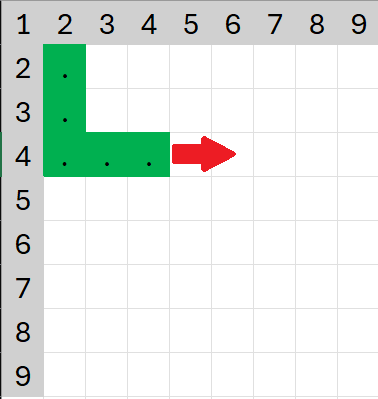

# Labor 1 - Snake Game

Az első labor folyamán egy összetettebb alkalmazást, játékot fogunk megcsinálni. Ez a játék a Snake játék egy változata lesz. A játék lényege, hogy egy fix méretű pályán egy kígyót kell irányítani, és minél több pontot összeszedni. Ezt az almák felvételével tudjuk elérni. Minden egyes alma felvétele egy egységgel fogja növelni a kígyó hosszát. A szokásos működéstől kicsit eltérő lesz a mi alkalmazásunk, itt 3 nehézség közül lehet majd választani (Easy, Normal, Hard), amelynek köszönhetően fix sebességű lesz a kígyó gyorsasága.

A feladat során az alábbi technológiákkal fogunk találkozni:

*   ViewModel
*   Dependency Injection
*   DataStore
*   Sensor
*   NavHost


<p align="center">


</p>

A játéknak két fajta irányítási lehetősége lesz. Az egyik a nyilakkal lesz elvégezhető, a másik pedig a telefon döntögetésével. Ezt a Sensor osztállyal fogjuk megvalósítani.

## Előkészületek

A feladatok megoldása során ne felejtsd el követni a [feladat beadása folyamatát](../../tudnivalok/github/GitHub).

### Git repository létrehozása és letöltése

1. Moodle-ben keresd meg a laborhoz tartozó meghívó URL-jét és annak segítségével hozd létre a saját repository-dat.

1. Várd meg, míg elkészül a repository, majd checkout-old ki.

    !!! tip ""
        Egyetemi laborokban, ha a checkout során nem kér a rendszer felhasználónevet és jelszót, és nem sikerül a checkout, akkor valószínűleg a gépen korábban megjegyzett felhasználónévvel próbálkozott a rendszer. Először töröld ki a mentett belépési adatokat (lásd [itt](../../tudnivalok/github/GitHub-credentials.md)), és próbáld újra.

1. Hozz létre egy új ágat `megoldas` néven, és ezen az ágon dolgozz.

1. A `neptun.txt` fájlba írd bele a Neptun kódodat. A fájlban semmi más ne szerepeljen, csak egyetlen sorban a Neptun kód 6 karaktere.

!!! info "Android, Java, Kotlin"
	Az Android hagyományosan Java nyelven volt fejleszthető, azonban az utóbbi években a Google átállt a [Kotlin](https://kotlinlang.org/) nyelvre. Ez egy sokkal modernebb nyelv, mint a Java, sok olyan nyelvi elemet ad, amit kényelmes használni, valamint új nyelvi szabályokat, amikkel például elkerülhetőek a Java nyelven gyakori `NullPointerException` jellegű hibák.

	Másrészről viszont a nyelv sok mindenben tér el a hagyományosan C jellegű szintaktikát követő nyelvektől, amit majd látni is fogunk. A labor előtt érdemes megismerkedni a nyelvvel, egyrészt a fent látható linken, másrészt [ezt](https://developer.android.com/kotlin/learn) az összefoglaló cikket átolvasva.

## Projekt létrehozása

Hozzunk létre egy Snake nevű projektet az Android Studioban:

1. Hozzunk létre egy új projektet, válasszuk az *Empty Activity* lehetőséget.
1. A projekt neve legyen `Snake`, a kezdőpackage `hu.bme.aut.android.snake`, a mentési hely pedig a kicheckoutolt repository-n belül a Snake mappa.
1. Nyelvnek válasszuk a *Kotlint*-t.
1. A minimum API szint legyen API24: Android 7.0.
1. A *Build configuration language* Kotlin DSL legyen.

!!!danger "FILE PATH"
	A projekt a repository-ban lévő Snake könyvtárba kerüljön, és beadásnál legyen is felpusholva! A kód nélkül nem tudunk maximális pontot adni a laborra!

!!!danger "FILE PATH"
    A repository elérési helye ne tartalmazzon ékezeteket, illetve speciális karaktereket, mert az AndroidStudio ezekre érzékeny, így nem fog a kód lefordulni. Érdemes a C:\\ meghajtó gyökerében dolgozni.

### Erőforrások letöltése

Töltsük le az egyedi [fontFamily](./downloads/pixelfont.TTF)-t, valamint a szükséges [képeket](./downloads/res.zip), majd helyezzük el őket a res mappában a következő szerint.

1. A letöltött .TTF filet tegyük a res/font mappába. Ehhez hozzunk létre egy új packaget a res mappán belül font néven.
1. A letöltött .ZIP file tartalmát pedig helyezzük el az ennek megfelelő mipmap-... mappákba.

Miután ezekkel megvagyunk vegyük fel a következő függőségeket a `libs.versions.toml` illetve a `build.gradle.kts` fileba.

`libs.versions.toml`

```toml
[versions]
agp = "8.8.1"
kotlin = "2.0.0"
coreKtx = "1.15.0"
navigationComposeVersion = "2.8.7"
roomRuntime = "2.6.1"
datastorePreferences = "1.1.2"
lifecycleRuntimeKtx = "2.8.7"
runtimeLivedata = "1.7.8"
hiltNavigationCompose = "1.2.0"
hiltAndroid = "2.51.1"
activityCompose = "1.10.0"
composeBom = "2025.02.00"

[libraries]
androidx-core-ktx = { group = "androidx.core", name = "core-ktx", version.ref = "coreKtx" }
androidx-activity-compose = { group = "androidx.activity", name = "activity-compose", version.ref = "activityCompose" }
androidx-compose-bom = { group = "androidx.compose", name = "compose-bom", version.ref = "composeBom" }
androidx-ui = { group = "androidx.compose.ui", name = "ui" }
androidx-ui-graphics = { group = "androidx.compose.ui", name = "ui-graphics" }
androidx-ui-tooling = { group = "androidx.compose.ui", name = "ui-tooling" }
androidx-ui-tooling-preview = { group = "androidx.compose.ui", name = "ui-tooling-preview" }
androidx-ui-test-manifest = { group = "androidx.compose.ui", name = "ui-test-manifest" }
androidx-ui-test-junit4 = { group = "androidx.compose.ui", name = "ui-test-junit4" }
androidx-material3 = { group = "androidx.compose.material3", name = "material3" }

navigation-compose = { module = "androidx.navigation:navigation-compose", version.ref = "navigationComposeVersion" }
androidx-room-ktx = { module = "androidx.room:room-ktx", version.ref = "roomRuntime" }
androidx-room-runtime = { module = "androidx.room:room-runtime", version.ref = "roomRuntime" }
androidx-datastore-preferences = { module = "androidx.datastore:datastore-preferences", version.ref = "datastorePreferences" }
androidx-lifecycle-runtime-compose-android = { group = "androidx.lifecycle", name = "lifecycle-runtime-compose-android", version.ref = "lifecycleRuntimeKtx" }
androidx-lifecycle-runtime-ktx = { module = "androidx.lifecycle:lifecycle-runtime-ktx", version.ref = "lifecycleRuntimeKtx" }
androidx-lifecycle-viewmodel-compose = { module = "androidx.lifecycle:lifecycle-viewmodel-compose", version.ref = "lifecycleRuntimeKtx" }
androidx-lifecycle-livedata-ktx = { module = "androidx.lifecycle:lifecycle-livedata-ktx", version.ref = "lifecycleRuntimeKtx" }
androidx-lifecycle-viewmodel-ktx = { module = "androidx.lifecycle:lifecycle-viewmodel-ktx", version.ref = "lifecycleRuntimeKtx" }
androidx-runtime-livedata = { group = "androidx.compose.runtime", name = "runtime-livedata", version.ref = "runtimeLivedata" }
androidx-hilt-navigation-compose = { module = "androidx.hilt:hilt-navigation-compose", version.ref = "hiltNavigationCompose" }
hilt-android = { module = "com.google.dagger:hilt-android", version.ref = "hiltAndroid" }
hilt-compiler = { module = "com.google.dagger:hilt-compiler", version.ref = "hiltAndroid" }
androidx-room-compiler = { module = "androidx.room:room-compiler", version.ref = "roomRuntime" }
[plugins]
android-application = { id = "com.android.application", version.ref = "agp" }
kotlin-android = { id = "org.jetbrains.kotlin.android", version.ref = "kotlin" }
kotlin-compose = { id = "org.jetbrains.kotlin.plugin.compose", version.ref = "kotlin" }
hilt-android = { id = "com.google.dagger.hilt.android", version.ref = "hiltAndroid" }
kotlin-kapt = { id = "org.jetbrains.kotlin.kapt", version.ref = "kotlin" }
```

`build.gradles.kts` (Modul szintű)
```kts
dependencies {
    implementation(libs.androidx.core.ktx)
    implementation(libs.androidx.lifecycle.runtime.ktx)
    implementation(libs.androidx.activity.compose)
    implementation(platform(libs.androidx.compose.bom))
    implementation(libs.androidx.ui)
    implementation(libs.androidx.ui.graphics)
    implementation(libs.androidx.ui.tooling.preview)
    implementation(libs.androidx.material3)
    androidTestImplementation(platform(libs.androidx.compose.bom))
    androidTestImplementation(libs.androidx.ui.test.junit4)
    debugImplementation(libs.androidx.ui.tooling)
    debugImplementation(libs.androidx.ui.test.manifest)

    // Hilt for DI
    implementation(libs.hilt.android)
    kapt(libs.hilt.compiler)
    implementation(libs.androidx.hilt.navigation.compose)

    // LiveData and ViewModel
    implementation(libs.androidx.runtime.livedata)
    implementation (libs.androidx.lifecycle.viewmodel.ktx)
    implementation(libs.androidx.lifecycle.livedata.ktx)
    implementation(libs.androidx.lifecycle.runtime.ktx)
    implementation(libs.androidx.lifecycle.viewmodel.compose)
    implementation(libs.androidx.lifecycle.runtime.compose.android)

    // DataStore for preferences
    implementation (libs.androidx.datastore.preferences)

    //Room for database
    implementation(libs.androidx.room.runtime)
    implementation(libs.androidx.room.ktx)
    kapt(libs.androidx.room.compiler)

    //Navigation, lifecycle
    implementation(libs.navigation.compose)
}
```
`build.gradle.kts` (Modul szintű)
```kotlin
plugins{
    alias(libs.plugins.android.application)
    alias(libs.plugins.kotlin.android)
    alias(libs.plugins.kotlin.compose)
    alias(libs.plugins.hilt.android)
    alias(libs.plugins.kotlin.kapt)
}
android {
    //...
    compileSdk = 35
    defaultConfig{
        //...
        minSdk = 24
        targetSdk = 35
        //...
    }
    //...
    composeOptions {
        kotlinCompilerExtensionVersion = "1.5.15"
    }
    //...
}
```

Majd a Project szintű `build.gradle.kts` filet nyissuk meg és adjuk hozzá a HILT-et illetve a KAPT-ot.

`build.gradle.kts (Snake)`
```kts
plugins {
    //...
    alias(libs.plugins.hilt.android) apply false
    alias(libs.plugins.kotlin.kapt) apply false
}
```

Hogy ha mindennel megvagyunk Sync-eljük le a projektet és várjuk meg míg legölt az összes szükséges könyvtár.

## Navigáció a képernyők között (2.5 pont)

Elsőként hozzuk létre a szükséges képernyőket. Még csak demoként lesznek meg, egy teszt szöveggel, majd a további feladatok során kiegészítjük a tényleges képernyővel. Ahhoz hogy a képernyők között navigálni tudjunk, szükségünk van a NavHost-ra amiben definiáljuk az egyes kijelzőkre mutató utat. Ehhez hozzunk létre egy új Packaget `navigation` néven. Ezen belül fogunk első sorban dolgozni. Itt hozzunk létre egy `NavGraph` nevü Kotlin fájlt. 

Az alkalmazásban 6 képernyőnk lesz, ezek:

*   Főképernyő (MainScreen)
*   Eredmények képernyő (HighScoresScreen)
*   Beállítások képernyő (SettingsScreen)
*   Játék beállítás képernyő (StartGameScreen)
*   Játék képernyő (GameScreen)
*   MainNavScreen (TopBar-os screen)

Az utolsó Screen igény szerint változtatható, itt most csak a TopBar miatt fogjuk ezt használni. A képernyők felépítése ezen belül fog változni. A MainNavScreen-en belül lesz egy Scaffold aminek a segítségével beállítunk egy TopAppBar-t. A Content-je pedig egy NavHost-t Graphot fog tartalmazni, aminek a segítségével fogunk váltani az oldalak között.

A TopBar megvalósítását az alábbiak alapján szeretnénk megvalósítani:

*   A Főképernyőn legyen kiírva hogy "Snake" és semmi más.
*   Beállítás képernyőn legyen egy kis ikon amivel vissza lehet lépni a főképernyőre, valamint legyen title-nek beállítva hogy "Settings"
*   HighScores képernyőn hasonlóan a beállítás képernyőhöz, legyen egy ikon amivel vissza lehet lépni a főképernyőre, legyen a title "HighScores", illetve egy kuka ikon amivel lehet majd később törölni az adatbázist.
*   StartGameScreen-en hasonlóan legyen egy vissza gomb, illetve title-nek "Game Settings" legyen beállítva.
*   A GameScreen-en a felirat legyen egy üres string, ilyenkor a TopAppBar kikapcsolt állapotba fog kerülni.

Első sorban hozzunk létre egy új Package-t `main` néven a `feature` packageba, majd ebben egy `MainViewModel` nevű Kotlin fájlt. Erre azért lesz szükség, hogy a TopBar feliratát dinamikussan tudjuk majd kezelni, illetve az ikon működését is. Ebben a fájlban helyezzük el az alábbi kódot:

```kotlin
class MainViewModel : ViewModel() {
    private val _title = MutableLiveData("Main Menu")
    val title: LiveData<String> = _title

    private val _navigate = MutableLiveData<() -> Unit>()
    val navigate: LiveData<() -> Unit> = _navigate

    private val _showBackArrow = MutableLiveData(false)
    val showBackArrow: LiveData<Boolean> = _showBackArrow

    fun updateTitle(newTitle: String, showBackArrow: Boolean) {
        _title.value = newTitle
        _showBackArrow.value = showBackArrow
    }

    fun setNavigationLambda(lambda: () -> Unit) {
        _navigate.value = lambda
    }
}
```

Három változónk lesz, ezek közül az egyik egy Lambda. Ez a navigálásért fog felelni később, illetve van kettő függvényünk aminek a segítségével beállítjuk a privát változók értékét.


Ezután hozzunk létre a `feature` packagen belül újabb packageket, illetve bennük az oldalhoz tartozó fájlokat: `game`/`GameScreen`, `highscores`/`HighScoresScreen`, `main`/`MainNavScreen`, `main`/`MainScreen`, `settings`/`SettingsScreen`, `startgame`/`StartGameScreen`. Ezek lesznek az alkalmazás képernyői, kezdetben még csak Demo-ra lesz állítva, és a későbbiekben fogjuk megvalósítani a tényleges kinézetüket.

Folytatásként kezdjük el a `MainNavScreen` megírását, ugyanis ez fog felelni azért, hogy a `NavHost` *Graphot* tartalmazza.

Ennek egy Scaffoldból kell állnia ami dinamikusan fogja kezelni a TopBar-t a képernyőtől függően. Ehhez korábban már létrehoztuk a viewModellünket, ennek a segítségével fogjuk megvalósítani ezt a működést.

Mielőtt elkezdenénk a Scaffold-ot, valósítsuk meg a NavGraph-ot a `navigation`/`NavGraph.kt` file-ban.

```kotlin
@Composable
fun NavGraph(
    modifier: Modifier = Modifier,
    navController: NavHostController = rememberNavController(),
    startDestination: String = "mainscreen",
    mainViewModel: MainViewModel = viewModel()
) {

    NavHost(
        navController = navController,
        startDestination = startDestination,
        modifier = modifier
    ){
        //gameScreen

        //preGameScreen
        
        //mainscreen
        
        //highscores
        
        //settings
    
    }
}
```
Mivel 5 képernyőnk lesz még ezen kívül, ezért 5 különböző navigáció is fog kelleni, amit majd később megvalósítunk, miután mindegyikhez kész van a demo screen. A NavGraph paraméternek megkapja a navControllert, aminek a segítségével fogunk navigálni az ablakok között. Továbbá egy startDestinationt, ami azt fogja megmondani, hogy melyik az a képernyő amit elsőnek meg kell jeleníteni, valamint a mainViewModel-t. Ennek a segítségével fogjuk változtatni dinamikusan a TopBar megjelenését. A későbbiekben a paraméterlista bővülni fog. :)


A TopAppBar működéséről az [alábbi](https://developer.android.com/develop/ui/compose/components/app-bars) oldalon jobban meg lehet ismerkedni. Nekünk jelen esetben a `navigationIcon`, `actions`, `title`, `color` attribútumokra lesz szükségünk. Kezdjük is el a Scaffold felépítését. Ehhez navigáljunk a `MainNavScreen` fájlba.

```kotlin
@OptIn(ExperimentalMaterial3Api::class)
@Composable
fun MainNavScreen(
    mainViewModel: MainViewModel
){

    //TopBar
    val title by mainViewModel.title.observeAsState("Snake")
    val navigationLambda by mainViewModel.navigate.observeAsState()
    val showBackArrow by mainViewModel.showBackArrow.observeAsState(false)

    Scaffold(
        topBar = {
            if (title != ""){
                TopAppBar(
                    //NavigationIcon
                    navigationIcon = {
                        // TODO
                    },
                    //Actions
                    actions = {
                        // TODO
                    },
                    //Title
                    title = {
                        // TODO
                    },
                    //Colors
                    colors = TopAppBarDefaults.topAppBarColors(containerColor = DarkGray)
                )
            }
        },
        modifier = Modifier.fillMaxSize()
    ) { innerPadding ->

        val navController = rememberNavController()

        NavGraph(
            modifier = Modifier.padding(innerPadding),
            navController = navController,
        )
    }
}
```

Az alábbi kód a MainNavScreen skeletonját mutatja. Ezt a következőekben felépítjük a szükséges elemekkel. Jól látható a TopAppBar, valamint azok az elemek amiket fogunk használni. Egy *if* elágazással szűrjük a TopAppBar megjelenését, amit korábban kikötöttünk, hogy üres *String* esetén nem jelenítjük meg. (Ez akkor következik be hogy ha már a játék folyamatban van.)

`NavigationIcon`
```kotlin
if (showBackArrow)
IconButton(
    onClick = {
        navigationLambda?.invoke()
    }
) {
    Icon(
        imageVector = Icons.AutoMirrored.Filled.ArrowBack,
        contentDescription = "Back"
    )
}
```
A vissza nyíl megjelenése egy boolean változótól függ, ugyanis a főképernyőn erre nincs szükség. Ilyenkor ezt a Boolean változó False értékbe való billentésével megakadályozzuk, hogy látható legyen. Az `onClick` esemény megkapja a viewModel értékét, amit az `?.invoke()` függvénnyel tudunk elsütni.

`Actions`
```kotlin
if (title == "High Scores"){
    IconButton(
        onClick = {
            //TODO
        }
    ) {
        Icon(
            imageVector = Icons.Default.Delete,
            contentDescription = "Delete",
            tint = White
        )
    }
}
```
Hogy ha a HighScores képernyőn vagyunk szeretnénk egy extra ikont, aminek a segítségével üríthetjük az adatbázist, amit később létre fogunk hozni. Ehhez szintén egy *if* elágazást használunk.

`Title`

```kotlin
Text(
    text = title,
    color = White,
    fontSize = 30.sp,
    fontFamily = FontFamily(Font(R.font.pixelfont, style = FontStyle.Normal)),
)
```
Az AppBar felirata a title változó értékének a segítségével jeleníthető meg. Ez csak egy szimpla `Text Composable` függvényt igényel.

Ezzel el is készült a `MainNavScreen` demója.

!!!info "Icon"
    Előfordulhat, hogy a megadott Icon nem lesz elérhető egyesek számára. Ez a projekt verziójától függ. Ilyenkor csak cseréljük le az Icon-t egy másikra.

A továbbiakban folytassuk az egyes képernyők felépítésével, illetve a NavGraph kiegészítésével.

### Main Screen
A következő lépsben a Main Screent fogjuk megvalósítani.

Ehhez egészítsük ki a MainScreen képernyőt az alábbival:

```kotlin
@Composable
fun MainScreen(
    navController: NavController
) {
    Column (
        modifier = Modifier
            .background(Color.Gray)
            .padding(16.dp)
            .fillMaxSize(),
        horizontalAlignment = Alignment.CenterHorizontally,
        verticalArrangement = Arrangement.Center
    ) {

        //Title
        
        //Button 1 preGameScreen
        
        //Button 2 highScores 
        
        //Button 3 settings
        
    }
}
```

A megfelelő Commentek alá, végezzük el a kiegészítést az alábbiak szerint:

`Title`

```kotlin
Text(
    text = "Snake Game",
    color = Color.White,
    fontSize = 40.sp,
    fontFamily = FontFamily(Font(R.font.pixelfont, style = FontStyle.Normal)),
    modifier = Modifier.padding(16.dp)
)
```

Ez a Title felirat csak egy `Text` Composable függvényt fog magába foglalni, amin megjelenítjük a játék címét, vagy bármilyen feliratot. Mi most a *Snake Game* feliratot fogjuk megjeleníteni ezzel. Látható, hogy adunk egy fontFamily értéket is neki, így fogjuk elérni az egyedi betűtípusunkat.

`Button 1`

```kotlin
Button(
    onClick = {
        navController.navigate("preGameScreen")
    },
    colors = ButtonDefaults.buttonColors(
        Color.Black
    ),
    modifier = Modifier.padding(8.dp)
) {
    Text(
        text = "Start Game",
        fontSize = 30.sp,
        fontFamily = FontFamily(Font(R.font.pixelfont, style = FontStyle.Normal)),
    )
}
```

Az első gomb fog felelni a játék indításáért, azonban ez a gomb még nem fogja elindítani a játékot, hanem egy új képernyőre fog navigálni, ahol ki lehet választani a játék nehézségét, valamint megadni a játékos nevét. Itt az `onClick` eseménynek átadjuk a `navController.navigate(..)` függvényt, amelynek a paraméterébe beírjuk az adott képernyőt ahova navigálni szeretnénk.

`Button 2`

```kotlin
Button(
    onClick = {
        navController.navigate("highscores")
    },
    colors = ButtonDefaults.buttonColors(
        Color.Black
    ),
    modifier = Modifier.padding(8.dp)
) {
    Text(
        text = "High Scores",
        fontSize = 30.sp,
        fontFamily = FontFamily(Font(R.font.pixelfont, style = FontStyle.Normal)),
    )
}
```

A második gombunk ugyanolyan elven működik mint az első, és mint a harmadik fog, itt meg kell változtatnunk a `.navigate(..)` paraméterét, hogy a HighScores képernyőre navigáljon minket.

`Button 3`

```kotlin
Button(
    onClick = {
        navController.navigate("settings")
    },
    colors = ButtonDefaults.buttonColors(
        Color.Black
    ),
    modifier = Modifier.padding(8.dp)
) {
    Text(
        text = "Settings",
        fontSize = 30.sp,
        fontFamily = FontFamily(Font(R.font.pixelfont, style = FontStyle.Normal)),
    )
}
```

A harmadik gomb sem különb az első kettőtől, azt leszámítva, hogy ez a beállítás képernyőre fog navigálni minket.

Majd végül regisztráljuk az útvonalat a NavGraph-ban is

```kotlin
composable("mainscreen"){
    mainViewModel.updateTitle("Snake", false)
    MainScreen(navController = navController)
}
```

Ezzel el is készült a főképernyő, azonban, ha az alkalmazást most elindítjuk még nem teljesen fog működni, ugyanis a többi képernyőre mutató navigáció még nincs kész, illetve a MainActivity-ben nincs meghívva a megfelelő Composable.

### Settings Screen
Az előzőhöz hasonlóan valósítsuk meg a módosításokat a Settings Screen illetve a NavGraph-ban.

```kotlin
@Composable
fun SettingsScreen() {
    Column (
        Modifier
            .fillMaxSize()
            .background(Color.Gray),
        horizontalAlignment = Alignment.CenterHorizontally,
        verticalArrangement = Arrangement.Center
    ) {
        Text(text = "Settings Screen")
    }
}
```
Ez csak egy szimpla Column elrendezést fog használni kezdetben. Ezt a Demó képernyőt később le fogjuk cserélni, egyelőre csak a működését fogjuk vizsgálni a NavGraph-nak.

Ehhez illesszük be a megfelelő helyre az alábbi kódot a NavGraph-ban

```kotlin
composable("settings"){
    mainViewModel.updateTitle("Settings", true)
    mainViewModel.setNavigationLambda { navController.navigate("mainscreen") }
    SettingsScreen()
}
```
Itt a navigáción belül beállítjuk viewModel értékeket ami a TopBar-ért felel, valamint meghívjuk az imént megírt képernyő Composable függvényét.

### High Scores Screen
Az előzőhöz hasonlóan hajtsuk végre ugyanazt a működést a High Scores Screen-re is.

```kotlin
@Composable
fun HighScoresScreen() {
    Column (
        Modifier
            .fillMaxSize()
            .background(Color.Gray),
        horizontalAlignment = Alignment.CenterHorizontally,
        verticalArrangement = Arrangement.Center
    ) {
        Text(text = "High Scores Screen")
    }
}
```

```kotlin
composable("highscores"){
    mainViewModel.updateTitle("High Scores", true)
    mainViewModel.setNavigationLambda { navController.navigate("mainscreen") }
    HighScoresScreen()
}
```

Hasonlóan az előzőhöz, itt is módosítjuk a mainViewModel paramétereit úgy, hogy *High Scores* felirat legyen a TopAppBar-on, illetve a vissza nyíl a főképernyőre mutasson.

### Game Settings Screen

Ehhez egyelőre csak beégetett adatot fogunk használni a játékosnév, illetve a nehézséghez, de ez később módosítva lesz.
Nyissuk meg a `StartGameScreen` file-t, majd módosítsuk a tartalmát az alábbiak szerint.

```kotlin
@Composable
fun StartGameScreen(
    navController: NavHostController
){
    Column (
        Modifier
            .fillMaxSize()
            .background(Color.Gray),
        horizontalAlignment = Alignment.CenterHorizontally,
        verticalArrangement = Arrangement.Center
    ) {
        Text(text = "Start Game Screen")
        Button(
            onClick = {
                navController.navigate("gameScreen/medium/Player1")
            }
        ) {
            Text(text = "Start Game")
        }
    }
}
```

A navController segítségével átadhatunk navigációs argumentumokat, amit később ki fogunk tudni szedni a `NavGraph`-on belül. Ezeket a *Stringeket* tudjuk majd felhasználni a játék további paramétereihez.

Modosítsuk a `NavGraph`-ot úgy, hogy megadjuk az elérési utat az imént létrehozott képernyőhöz.

```kotlin
composable("preGameScreen") {
    mainViewModel.updateTitle("Game Settings", true)
    mainViewModel.setNavigationLambda { navController.navigate("mainscreen") }
    StartGameScreen(
        navController = navController
    )
}
```
Az előzőekhez hasonlóan itt is beállítjuk a mainViewModel-ben a TopBar paramétereit, valamint meghívjuk az elkészített képernyőt.

Már csak egyetlen képernyő van hátra, ez maga a játék képernyője lesz. Kezdetben ez is csak egy Demo képernyő lesz ami meg fogja jeleníteni a beégetett Játékos nevét, illetve a játék nehézségét.

### Game Screen
`GameScreen`
```kotlin
@Composable
fun GameScreen(
    difficulty: String,
    name: String,
) {
    Column (
        Modifier
            .fillMaxSize()
            .background(Color.Gray),
        horizontalAlignment = Alignment.CenterHorizontally,
        verticalArrangement = Arrangement.Center
    ) {
        Text(text = "Game Screen")
        Text(text = "Difficulty: $difficulty")
        Text(text = "Name: $name")
    }
}
```
Jól látható, hogy itt paraméterként kapja meg a szükséges adatokat, de ez később viewModel-re lesz lecserélve, ez csak a kezdeti játék állapotát fogja modellezni.

Már csak egy a `NavGraph`-ban meg kell adni az elérési utat, illetve a MainActivity-ben meg kell hívni a főképernyő Composable függvényét.

`NavGraph`

```kotlin
composable(
    "gameScreen/{playerName}/{difficulty}",
    arguments = listOf(
        navArgument("playerName") { type = NavType.StringType },
        navArgument("difficulty") { type = NavType.StringType }
    )
){
    mainViewModel.updateTitle("", false)
    GameScreen(
        name = it.arguments?.getString("playerName") ?: "",
        difficulty = it.arguments?.getString("difficulty") ?: ""
    )
}
```
Láthatjuk, hogy navigációs argumentumokat az `arguments` segítségével lehet kiszedni, majd a `navArgument` segítségével lehet egyesével eltárolni és felhasználni adatként.

Módosítsuk a `MainActivity`-t úgy, hogy a mainViewModel példányosítva legyen, és adjuk át paraméterként a `MainNavScreen`nek.

`MainActivity`

```kotlin
class MainActivity : ComponentActivity() {

    private val mainViewModel: MainViewModel by viewModels()

    override fun onCreate(savedInstanceState: Bundle?) {
        super.onCreate(savedInstanceState)
        enableEdgeToEdge()
        setContent {
            SnakeTheme {
                MainNavScreen(
                    mainViewModel = mainViewModel
                )
            }
        }
    }
}
```

Ha mindent jól csináltunk akkor az alkalmazás elindítása után a főképernyő fogad minket ahonnan a gombok segítségével el tudunk navigálni az egyes képernyőkre.

!!!example "BEADANDÓ (2.5 pont)"
    Készíts **5 képernyő képet** az elkészült képernyőkről, amelyen látszik az **elkészült oldal** (emulátoron, készüléket tükrözve vagy képernyőfelvétellel), egy **ahhoz tartozó kódrészlet**, valamint a **neptun kódod a kódban valahol kommentként**. A képeket a megoldásban a repository-ba f1a.png, f1b.png, f1c.png, f1d.png, f1e.png néven töltsd föl.

## Képernyők kiegészítése (2.5 pont)

A második feladat a már meglévő képernyők megtervezése és kiegészítése lesz. A dokumentáció elején látható képernyőket szeretnénk megvalósítani. Ehhez kezdjük először a legegyszerűbb képernyővel. Ez a Settings Screen lesz, itt csak egyetlen kapcsolót fogunk megjeleníteni, amivel majd a későbbiek során foglalkozunk, amikor a Sensor részét is beleépítettük az alkalmazásba. Ehhez nyissuk meg a SettingsScreen fájlt, és módosítsuk az alábbiak szerint.

### Settings Screen 

<p align="center">

</p>

```kotlin
@Composable
fun SettingsScreen() {
    var isSensorControlled by remember {
        mutableStateOf(false)
    }
    Column (
        horizontalAlignment = Alignment.CenterHorizontally,
        verticalArrangement = Arrangement.Top,
        modifier = Modifier
            .background(Color.Gray)
            .fillMaxSize()
    ) {
        Row (
            horizontalArrangement = Arrangement.SpaceBetween,
            verticalAlignment = Alignment.CenterVertically,
            modifier = Modifier
                .padding(8.dp)
                .fillMaxWidth()
        ) {
            Text(
                text = "Sensor  Controlled",
                color = Color.White,
                fontSize = 26.sp,
                fontFamily = FontFamily(Font(R.font.pixelfont, style = FontStyle.Normal)),
            )
            Switch(
                checked = isSensorControlled,
                onCheckedChange = {
                    isSensorControlled = it
                }
            )
        }
    }
}
```

Kezdetben a kapcsoló állapotát így fogjuk tárolni, viszont ez később viewModel formájában lesz megvalósítva, hogy majd a játék képernyő is megkapja az állapotot. Egy egyszerű Column van elhelyezve a képernyőn, amiben egyetlen Row van. Ez tartalmaz egy Label feliratot `Text` Composable függvénnyel, illetve egy kapcsolót a `Switch` Composable-vel.

Mivel az `isSensorControlled` egy állapot, ezért minden egyes állapotváltozásnál az a Composable ami függ ettől a változótól újra rajzolódik, ezáltal a kapcsoló ki-be kapcsolható lesz.

Folytatásként egészítsük ki a High Scores Screent.

### High Scores Screen

<p align="center">

</p>

Ezt a képernyőt hasonlóan egy Column-ba ágyazva fogjuk megvalósítani, azonban szeretnénk egy fejlécet a táblázatos összefoglalónak. Ezt egy Row segítségével fogjuk megvalósítani, a Contentjéhez pedig létrehozunk egy saját Composable függvényt, amely táblázatos formában fogja megjeleníteni az adatokat. Ehhez hozzunk létre egy `TableText` függvényt a HighScoresScreen-en belülre az alábbiak szerint:

```kotlin
@Composable
fun TableText(text: String, modifier: Modifier = Modifier) {
    Column (
        modifier = modifier,
        verticalArrangement = Arrangement.Center,
        horizontalAlignment = Alignment.CenterHorizontally
    ) {
        Text(
            text = text,
            fontSize = 20.sp,
            color = Color.White,
            fontFamily = FontFamily(Font(R.font.pixelfont, style = FontStyle.Normal)),
            modifier = Modifier.padding(8.dp)
        )
    }
}
```

A függvény két paramétert fog kapni, az egyik egy String típusút ez fogja az adatot tartalmazni, a másik pedig egy Modifier, aminek a segítségével beállítjuk az oszlop súlyait. Jelen esetben nekünk 2-1-2-es súlyozásra lesz szükségünk. 

```kotlin

@Composable
fun HighScoresScreen() {

    val highScores = listOf(
        Triple("John", 100, "Easy"),
        Triple("Jane", 200, "Medium"),
        Triple("Jack", 300, "Hard"),
    )
    Column (
        Modifier
            .fillMaxSize()
            .background(Color.Gray)
    ) {
        Row (
            Modifier
                .background(Color.Black)
                .fillMaxWidth(),
            horizontalArrangement = Arrangement.Center,
            verticalAlignment = Alignment.CenterVertically,
        ) {
            TableText("Name", Modifier.weight(2f))
            TableText("Score", Modifier.weight(1f))
            TableText("Difficulty", Modifier.weight(2f))
        }
        LazyColumn (
            Modifier
                .fillMaxSize()
        ) {
            items(highScores.size) { index ->
                Row (
                    Modifier
                        .background(Color.Gray)
                        .border(1.dp, Color.Black)
                        .fillMaxWidth(),
                    horizontalArrangement = Arrangement.SpaceBetween,
                    verticalAlignment = Alignment.CenterVertically
                ){
                    TableText(highScores[index].first, Modifier.weight(2f))
                    TableText(highScores[index].second.toString(), Modifier.weight(1f))
                    TableText(highScores[index].third, Modifier.weight(2f))
                }
            }
        }
    }
}

```
Kezdetben csak beégetett adatokkal fogunk dolgozni, ezt később lecseréljük adatbázisos adatokra. A High Score lista 3 adatból fog állni, név, pontok, és nehézség. Ezt az adatot egy LazyColum segítségével fogjuk megjeleníteni a képernyőn. Ehhez meg kell adni a lista méretét, illetve azt hogy mit jelenítsen meg. Ehhez szintén a TableText Composable függvényt használjuk. A LazyColumn fölött egy Row-t helyeztünk el, amely hasonlóan kapta a Content-et, mint a LazyColumn, a különbség az, hogy ez nem része a LazyColumn-nak, ez egy *fejlécként* szolgál nekünk, amelynek a pozíciója fix.

### Game Settings Screen
<p align="center">

</p>
Harmadik lépésben a Game Settings Screent fogjuk módosítani az alábbiak alapján. 

*   Tartalom a képernyő közepén helyezkedjen el
*   Egy Sliderrel fogjuk állítani a játék nehézségét
*   Egy TextFieldbe fogjuk írni a játékos nevét
*   Egy gombbal fogjuk indítani a játékot, amely a következő képernyőre navigál az adatainkkal.

Ennek a megvalósításához használjuk az alábbi kódot:
```kotlin
@Composable
fun StartGameScreen(
    modifier: Modifier = Modifier,
    navController: NavController,
){

    var playerName by remember { mutableStateOf("") }
    var difficulty by remember { mutableStateOf(GameDifficulty.EASY) }

    var emptyField by remember { mutableStateOf(false) }

    Column (
        modifier = modifier
            .background(Color.Gray)
            .padding(16.dp)
            .fillMaxSize(),
        horizontalAlignment = Alignment.CenterHorizontally,
        verticalArrangement = Arrangement.Center
    ) {
        
        //GameModeMap
        

        //Difficulty Label
        

        //Difficulty Slider
        
        
        //Name Field
        

        //Start Button
        

    }
}

enum class GameDifficulty {
    EASY,
    MEDIUM,
    HARD
}
```

Ahhoz hogy a játék nehézségét illetve a játékos nevet tudjuk állítani, szükségünk van két változóra, illetve még plusz egy változóra, hogy a felhasználó ne tudjon játékos név megadása nélkül tovább lépni a következő képernyőre. A következő lépéseket követve egészítsük ki a hiányzó UI elemeket.

#### Game Mode Map

```kotlin
val gameModeMap = mapOf(
    0.0 to Triple(GameDifficulty.EASY, 0.0, Color.Green),
    0.5 to Triple(GameDifficulty.MEDIUM, 0.5, Color.Yellow),
    1.0 to Triple(GameDifficulty.HARD, 1.0, Color.Red)
)
```

Ennek a map-nek a segítségével fogjuk nyilván tartani az egyes értékekhez tartozó adatokat. 3 állapot lesz a Slider-en:

1. Bal oldalon
2. Középen
3. Jobb oldalon

Ezekhez mindegyikhez hozzá van rendelve egy Triple map, ami tartalmazza a játék nehézségét egy Enum Class segítségével, magát a Slider értékét, illetve egy színt, amivel könnyen tudjuk demonstrálni a játék nehézségét a Label feliraton.

#### Difficulty Label

```kotlin
Text(
    text = difficulty.toString(),
    color = gameModeMap.values.first { it.first == difficulty }.third,
    fontSize = 30.sp,
    fontFamily = FontFamily(Font(R.font.pixelfont, style = FontStyle.Normal)),
)
```

Ez fog felelni a nehézség feliratáért. Itt értékként átadjuk az egyik változónk értékét, majd színnek az előbb létrehozott map értékét. Itt egy predikátum segítségével kiszűrjük az aktuális játék nehézséget, majd átadjuk a harmadik értékét a color attribútumnak.

#### Difficulty Slider

```kotlin
Slider(
    value = gameModeMap.values.first { it.first == difficulty }.second.toFloat(),
    onValueChange = {
        difficulty = gameModeMap[it.toDouble()]!!.first
    },
    colors = SliderDefaults.colors(
        thumbColor = Color.Black,
        activeTrackColor = Color.Black,
        inactiveTrackColor = Color.Black
    ),
    steps = 1,
    valueRange = 0f..1.0f
)
```

Az előzőhöz hasonlóan a GameModeMap-et használva átaduk az értéket a Slider-nek, csak itt nekünk a második adatra van szükség. Hogy ha az értéket változtatjuk, akkor magát a difficulty változót kell felülírni az új értékkel. A steps, illetve a valueRange segítségével beállíthatjuk a Slider működését, nekünk most 0.0-1.0 közötti értékekre van szükségünk és azon belül egy lépéses Sliderre.

#### Name Field

```kotlin
OutlinedTextField(
    value = playerName,
    onValueChange = {
        playerName = it
    },
    isError = emptyField,
    supportingText = { if (emptyField) Text(
        text = "Please enter a name",
        fontSize = 20.sp,
        fontFamily = FontFamily(Font(R.font.pixelfont, style = FontStyle.Normal)),
    ) },
    label = { Text(
        "Player Name",
        fontSize = 30.sp,
        fontFamily = FontFamily(Font(R.font.pixelfont, style = FontStyle.Normal)),
    ) },
    textStyle = TextStyle(
        fontFamily = FontFamily(Font(R.font.pixelfont, style = FontStyle.Normal)),
        fontSize = 30.sp
    )
)
```
Ez a TextField egy összetettebb Composable lesz, de a leírás alapján könnyne meg lehet érteni.

*   `value` - Ennek a paraméternek átadjuk magát a playerName változó értékét.
*   `onValueChange` - Ennek az attribútum segítségével adjuk meg egy lambdába, hogy mi történjen, hogy ha a felhasználó írt a TextField-be. Jelen esetben felülírjuk a változónk értékét, és mivel egy remember - mutableStateOf-os változóról van szó, ezért Recomposition valósul meg, így a friss értékét fogjuk látni a változónak.
*   `isError` - Itt egy Boolean változót tudunk átadni értékként, amire azért van szükség, hogy ha a felhasználó üressen hagyná ezt a mezőt, ne tudjun tovább lépni a következő képernyőre.
*   `supportingText` - Itt meg tudunk adni egyéb segítséget a felhasználónak, hogy ha üressen hagyná a mező értékét, és tovább szeretne lépni, akkor jelenítse meg a *Please enter a name* feliratot.
*   `label` - Ez egy kiegészítés az OutlinedTextField Composable függvényben. Ennek a segítségével tudunk megadni informáló feliratot, hogy az adott TextField miért felel.
*   `textStyle` - Ennek a segítségével tudunk beállítani új stílust a kiírásra.

#### Start Button

```kotlin
Button(
    onClick = {
        if (playerName.isNotEmpty()) {
            navController.navigate("gameScreen/${playerName}/${difficulty.name}")
        }else{
            emptyField = true
        }
    }) {
    Text(
        text = "Start Game",
        fontSize = 30.sp,
        fontFamily = FontFamily(Font(R.font.pixelfont, style = FontStyle.Normal)),
    )
}
```
Ez egy szimpla gomb, ami azért felel, hogy elindítsa a játékot, hogy ha a felhasználó mindent helyesen csinált. Az onClick eseménynek egy if-else elágazást adunk át, ami ellenőrzi, hogy a felhasználó írt-e be adatot a TextField-be. Hogy ha üresen hagyta, akkor a Boolean változót bebillenti true értékbe, aminek köszönhetően megjelenik az SupportingText üzenet. Ilyenkor a felhasználó nem tud tovább menni a következő ablakra mindaddig amíg a TextField üres.

Ahhoz hogy a GameScreen-t is meg tudjuk csinálni, ahhoz előtte magát a játék logikát kell megvalósítani. Folytatásként elkészítjük a játéknak az állapotait egy Data Class segítségével, majd a Snake-hez tartozó viewModel-t is.

!!!example "BEADANDÓ (2.5 pont)"
    Készíts **4 képernyő képet** az elkészült képernyőkről, amelyen látszik az **elkészült oldal** (emulátoron, készüléket tükrözve vagy képernyőfelvétellel), egy **ahhoz tartozó kódrészlet**, valamint a **neptun kódod a kódban valahol kommentként, és/vagy játékosnévként megadva**. A képeket a megoldásban a repository-ba f2a.png, f2b.png, f2c.png, f2d.png néven töltsd föl.


## Snake State / Snake View Model (4 pont)

### Snake State

Első lépésben elkészítjük a kígyó állapotáért felelős Data Classt. Készítsünk egy `model` packaget, amiben egy `SnakeState` Kotlin filet hozunk létre, majd a mellékelt kód segítségével megvalósítjuk a logikát.

```kotlin
data class SnakeState(
    val xSize: Int = 20,
    val ySize: Int = 30,
    val direction: Direction = Direction.RIGHT,
    //val prevDirection: Direction = Direction.RIGHT,
    val snake: List<Coordinate> = listOf(Coordinate(x = 5, y = 5)),
    val food: Coordinate = generateFood(xSize, ySize),
    val isGameOver: Boolean = false,
    val gameState: GameState = GameState.IDLE
) {

    //Companion Object - Generate Food
    

    //Get State
    

}
//GameState


//Direction


//Coordinate

```

Egészítsük ki a SnakeState Data Class Skeletonját az alábbiak szerint:

#### Generate Food
Ez a függvény egy random koordinátát fog generálni a pályán, úgy, hogy az adott koordináta X: 1-20 között, Y:1-30 közöttre essen. Ezt az alábbi függvénnyel tudjuk megvalósítani:

```kotlin
companion object {
    fun generateFood(
        xSize: Int,
        ySize: Int
    ): Coordinate {
        return Coordinate(
            x = Random.nextInt(from = 1, until = xSize-1),
            y = Random.nextInt(from = 1, until = ySize-1)
        )
    }
}
```
Azonban ez még hibát fog mutatni a kódszerkesztő felületen, de ennek a hiányzó Data Class az oka. A következő lépésben ezt fogjuk megvalósítani.

#### Coordinate Data Class

Ez a Data Class két attribútumot fog tartalmazni, egy X és egy Y. Ez fog felelni egyetlen koordinátának a helyéért.

```kotlin
data class Coordinate(
    val x: Int,
    val y: Int
)
```

A megadott kód segítségével egészítsük ki a fájlt.

#### Game State / Direction Enum Class

Ahhoz hogy minden hibát eltűntessünk a kódból létre kell hoznunk a hiányzó Enum Class-okat is. 

*   A GameState Enum Class a játék állapotáért felel
    *   IDLE - Kezdeti állapot
    *   STARTED - Fut
    *   Paused - Leállítva
*   Direction Enum Class pedig a jelenlegi irányt fogja tárolni.
    *   UP - A kígyó felfele megy
    *   DOWN - A kígyó lefele megy
    *   LEFT - A kígyó balra megy
    *   RIGHT - A kígyó jobbra megy

```kotlin
enum class GameState{
    IDLE, STARTED, PAUSED
}
```

```kotlin
enum class Direction{
    UP, DOWN, LEFT, RIGHT
}
```

Ezután már csak egy getter függvényre van szükség aminek a segítségével le tudjuk kérni a jelenlegi játék állapotát.

#### Get State függvény

```kotlin
fun getState(): GameState {
    return gameState
}
```
Ez egy egyszerű getter függvény, amely vissza adja a játék jelenlegi állapotát.
(Ha a GameState-re hibát dobna az Android Studio, töröljük az android-os `GameState` importot a fájl tetejéről)

Ezen kívűl meg kell valósítanunk egy egyszerű Sealed Class-t ami magáért az Eventekért fog felelni. 

*   Start Game
*   Pause Game
*   Reset Game
*   Change Dir

Ehhez hozzunk létre egy új Kotlin File-t a `model` packageba `SnakeEvent` néven, majd egészítsük ki az alábbi kód alapján:

```kotlin
sealed class SnakeEvent {
    data object StartGame: SnakeEvent()
    data object PauseGame: SnakeEvent()
    data object ResetGame: SnakeEvent()
    data class ChangeDir(val dir: Direction): SnakeEvent()
}
```

Végül szükségünk van magára a ViewModel-re, ami a kígyó viselkedéséért fog felelni.

### View Model
Ez a kód jóval hosszabb lesz mint az eddigiek, így a megértése nagy odafigyelést igényel!

```kotlin
class SnakeViewModel(): ViewModel(){
    //State
    private val _state = MutableStateFlow(SnakeState())
    val state = _state.asStateFlow()

    //Game Difficulty
    private val _gameDifficulty = MutableStateFlow(GameDifficulty.EASY)
    val gameDifficulty: StateFlow<GameDifficulty> = _gameDifficulty.asStateFlow()

    //Player Name
    private var playerName: String = ""

    //##FUNS##

    //Event Handling
    

    //Set Game Difficulty
    

    //Set Player Name
    

    //Start Game
    

    //Resume Game
    

    //Direction Update
    

    //Game Update
    

    //CHECK IF COORDINATE IS IN BOUNDS
    
}
```

Az egyes viewModel elemeket lépésről lépésre fogjuk hozzáadni a viewModellhez. Kezdetben a legegyszerűbbekkel fogjuk kezdeni.

**Set Game Difficulty**

```kotlin
fun setGameDifficulty(difficulty: GameDifficulty){
    _gameDifficulty.value = difficulty
}
```

Ez egy egyszerű függvény amelynek a segítségével a paraméterben átadott játéknehézséget fogja beállítani.

**Set Player Name**

Szintén az előzőhöz hasonlóan működve, ez a játékos nevét fogja beállítani.

```kotlin
fun setPlayerName(name: String){
    playerName = name
}
```

**Direction Update**

```kotlin
private fun updateDir(dir: Direction){
    _state.update { it.copy(direction = dir) }
}
```
Szintén hasonlóan működik, itt magát a kígyó menetirányát fogjuk állítani.

A következő egy kicsit hosszabb kód lesz, ez magát az Eventeket fogja kezelni, így muszáj mindegyik eventhez megvalósítani a működést.

**Event Handling**

```kotlin
fun onEvent(event: SnakeEvent){
    when(event){
        //Pause Game
        is SnakeEvent.PauseGame -> {
            //TODO
        }
        //Reset Game
        is SnakeEvent.ResetGame -> {
            //TODO
        }
        //Start Game
        is SnakeEvent.StartGame -> {
            //TODO
        }
        //Direction Handle
        is SnakeEvent.ChangeDir -> {
            //PASS IF GAME NOT STARTED
            
            //TODO

        }
    }
}
```

`Pause Game`

```kotlin
is SnakeEvent.PauseGame -> {
    _state.update { it.copy(gameState = GameState.PAUSED) }
}
```
Ha ez az event következik be, akkor a jelenlegi állapotát lemásoljuk a kígyónak, és gameState paraméterként átadjuk neki a PAUSED állapotot.

`Reset Game`
```kotlin
is SnakeEvent.ResetGame -> {
    _state.value = SnakeState()
}
```
Ha ez az állapot következik be, akkor egy teljesen új állapotot kap a kígyó, mint ha frissen indítanánk egy új játékot.

`Start Game`
```kotlin
is SnakeEvent.StartGame -> {
    _state.update { it.copy(gameState = GameState.STARTED) }
    startGame()
}
```
Ennél az állapotnál hasonlóan járunk el, mint a `Pause Game` állapotnál, csak itt a játék állapotát STARTED-re állítjuk.

`Direction Handle`
```kotlin
is SnakeEvent.ChangeDir -> {
    //PASS IF GAME NOT STARTED
    if (state.value.gameState != GameState.STARTED) {
        return
    }
    updateDir(
        when {
            event.dir == Direction.UP && state.value.direction != Direction.DOWN -> {
                Direction.UP
            }
            event.dir == Direction.DOWN && state.value.direction != Direction.UP -> {
                Direction.DOWN
            }
            event.dir == Direction.LEFT && state.value.direction != Direction.RIGHT -> {
                Direction.LEFT
            }
            event.dir == Direction.RIGHT && state.value.direction != Direction.LEFT -> {
                Direction.RIGHT
            }
            else -> state.value.direction
        }
    )
}
```
Végül magát az irányváltoztatásért felelős eseményt is megvalósítjuk az alábbiak szerint. Itt fontos, hogy az egyes irányváltoztatások csak akkor lehetségesek, hogy ha a választott irány az adott iránynak nem a 180 fokos elforgatása, ugyanis ilyenkor a kígyó saját magába forogna át, amely a játék végét eredményezné.

Ezután a Update Game függvényt kell megvalósítanunk, amelynek a segítségével a játék állapotát frissítjük, minden egyes mozgás után. Ez szintén egy hosszabb kód lesz, de igyekeztünk a lehető legjobban szétszedni.

**Update Game**

```kotlin
private fun updateGame(state: SnakeState) : SnakeState {
    //GAME OVER CHECK
    

    //HEAD, GRID SIZE
    val head = state.snake.first()
    val xGrid = state.xSize
    val yGrid = state.ySize

    //NEW HEAD COORDINATE
    val newHead = when (state.direction){
        
    }

    //GAME OVER - SNAKE HIT ITSELF OR WALL
    if (
        state.snake.contains(newHead) ||
        !isInBounds(
            newHead,
            xGrid,
            yGrid
        )
    ){
        //DATABASE INSERT
        return state.copy(isGameOver = true)
    }

    //NEW SNAKE AND FOOD
    
    return state.copy(snake = newSnake, food = newFood)
}
```

`GameOver Check`

Ez egy szimpla if elágazás ahol leellenőrizzük, hogy a játék Game Over állapotban van-e, vagy sem.
```kotlin
if (state.isGameOver){
    return state
}
```
`New Head Coordinates`

Ez egy kicsit összetettebb értékadás, ugyanis itt figyelembe kell venni a jelenlegi irányt is, és az alapján kell kiszámítani az új koordinátát.

```kotlin
val newHead = when (state.direction){
    Direction.UP -> Coordinate(x = head.x, y = (head.y - 1))
    Direction.DOWN -> Coordinate(x = head.x, y = (head.y + 1))
    Direction.LEFT -> Coordinate(x = head.x - 1, y = (head.y))
    Direction.RIGHT -> Coordinate(x = head.x + 1, y = (head.y))
}
```
`New Snake and Food`

```kotlin
var newSnake = mutableListOf(newHead) + state.snake
val newFood = if (newHead == state.food){
    SnakeState.generateFood(xGrid, yGrid)
} else {
    state.food
}

if (newHead != state.food){
    newSnake = newSnake.toMutableList()
    newSnake.removeAt(newSnake.lastIndex)
}
```
Itt létrehozunk egy új kígyót, amelynek az első eleme az új fej koordinátája lesz (newHead), majd ehhez hozzáfűzzük a már meglévő kígyónkat. Valamint új almát is kell generálnunk. Ehhez ellenőriznünk kell, hogy a kígyó megette-e az almát vagy sem. Ha megette akkor új almát generálunk, hogy ha nem ette meg, akkor a jelenlegi alma koordinátáját adjuk át az újnak.

!!!info "Megette, vagy sem?"
    Hogy megette-e az almát a kígyó vagy sem, azt onnan tudjuk, hogy a kígyó fejének a koordinátája megegyezik az alma koordinátáival! :)

Végül szükségünk van egy függvényre amit ugyan már felhasználtunk, de nem valósítottuk még meg. Ez az isInBound függvény lesz, ez azt ellenőrzi le, hogy a kígyó neki ment-e a falnak vagy sem. 
```kotlin
private fun isInBounds(coordinate: Coordinate, xGridSize: Int, yGridSize: Int): Boolean {
    return coordinate.x in 1 until xGridSize-1 && coordinate.y in 1 until yGridSize-1
}
```
Végül már csak két függvényünk van hátra a viewModellből amit az alábbi kód alapján meg fogunk tudni írni.

**Start Game**

Ez a függvény magáért a kígyó léptetéséért felel, illetve ez a függvény hívja meg az imént létrehozott *updateGame* függvényt megadott időközönként. (Ez a játék nehézségétől fog függeni.)

```kotlin
private fun startGame(){
    if (!state.value.isGameOver){
        _state.update { it.copy(gameState = GameState.STARTED) }
        viewModelScope.launch {
            gameDifficulty.collect { difficulty ->
                while (state.value.gameState == GameState.STARTED) {
                    val delayMillis = when (difficulty) {
                        GameDifficulty.EASY -> 320L
                        GameDifficulty.MEDIUM -> 220L
                        GameDifficulty.HARD -> 120L
                    }
                    _state.value = updateGame(state.value)
                    delay(delayMillis)
                }
            }
        }
    }
}
```
A függvény elején leellenőrizzük, hogy a játék még megy-e (az az nincs game over), majd ez alapján frissítjük az állapotot STARTED állapotba.

Ezután egy viewModelScope segítségével tudunk delay-t alkalmazni, ami a kígyó mozgásának késleltetéséért felel. A késleltetés a játék nehézségétől fog függeni.

Végül a resume game függvényt is meg tudjuk valósítani, amely elindítja a játékot a mentett pozícióból.

**Resume Game**

```kotlin
private fun resumeGame(){
    _state.update { it.copy(gameState = GameState.STARTED) }
    startGame()
}
```

Így még sajnos önmagában a projekt nem működik, ugyanis a Game Screen még nincs kész. A következő feladatban ezt is meg fogjuk valósítani, illetve a szükséges DrawScope függvényeket is létre fogjuk hozni.

!!!example "BEADANDÓ (4 pont)"
    Készíts **2 képernyőképet** az elkészült kódról, amelyen látszik a **SnakeState kódja, valamint a ViewModel-ben az Event kódja** (emulátoron, készüléket tükrözve vagy képernyőfelvétellel), egy **ahhoz tartozó kódrészlet**, valamint a **neptun kódod a kódban valahol kommentként**. A képeket a megoldásban a repository-ba f3a.png, f3b.png néven töltsd föl.

## Game Screen / DrawScope függvények (4 pont)


Ahhoz hogy a Game Screen-t el tudjuk készíteni először szükségünk van 3 DrawScope-ra. *DrawBoard*, *DrawFood*, *DrawSnake*. Ezek egy-egy DrawScope függvények, amellyeket meg tudunk hívni a Canvas Composable belsejében. Magát a pályát a játékot a Canvas Composable-val fogjuk megvalósítani.

A 3 DrawScopen kívül szükségünk van még egy pár segédfüggvényre, ezek a (BodyImage, IsTurn, TurnImage) függvények csak a játék szépítéséért felelnek, hogy ha a kígyónak nem csak egy kör alakú testet szeretnénk adni, hanem valami képet, vagy Icon-t, amin látszódik a kígyó fordulása is.

<p align="center">

</p>


Itt az alábbi példa megmutat egy olyan opciót amit meg kellene akadályoznunk ezekkel a függvényekkel.

Első sorban valósítsuk meg a DrawScope függvényeket. Ehhez hozzunk létre 1 új Packaget a gyökér mappában `draw` néven.

**DrawBoard**

Elsőnek valósítsuk meg a DrawBoard függvényünket. Ehhez hozzunk létre egy új Kotlin File-t a board packageben DrawBoard néven, majd írjuk bele az alábbi kódot.

```kotlin
fun DrawScope.drawBoard(
    cellSize: Float,
    cellColor: Color,
    borderCellColor: Color,
    gridWidth: Int,
    gridHeight: Int
){
    for (i in 0 until gridWidth){
        for (j in 0 until gridHeight){
            val isBorderCell = i == 0 || j == 0 || i == gridWidth - 1 || j == gridHeight - 1
            drawRect(
                color = if (isBorderCell) borderCellColor else cellColor,
                topLeft = Offset(i * cellSize, j * cellSize),
                size = Size(cellSize, cellSize)
            )
        }
    }
}
```

A függvény lényege, hogy paraméterként átadjuk a következőeket:

*   cellSize - Egyetlen cellának a mérete a Board-on.
*   cellColor - A cella színe, nekünk ez most alapból Fekete lesz.
*   borderCellColor - A Board szélének a színe. Szeretnénk megkülönböztetni a pálya színétől.
*   gridWidth - A Board szélessége
*   gridHeight - A Board magassága

A függvény belsejében kettő for ciklus található. Ennek a segítségével tudunk végig iterálni egy két dimenziós táblázaton. Az első for ciklus a Board szélességét kapja meg, a második pedig a magasságát. Ezen belül ellenőrizzük, hogy a Board széleit rajzoljuk-e ki vagy sem, majd ettől a változótól függően színezzük ki a rajzolt téglalapokat.

**DrawFood**

Folytatásként hozzuk létre a DrawFood nevű Kotlin File-t a food nevű Package-ban, majd a mellékelt kód alapján írjuk meg.

```kotlin
fun DrawScope.drawFood(
    foodImage: ImageBitmap,
    cellSize: Int,
    coordinate: Coordinate
){
    drawImage(
        image = foodImage,
        dstOffset = IntOffset(coordinate.x * cellSize, coordinate.y * cellSize),
        dstSize = IntSize(cellSize, cellSize)
    )
}
```

Ez egy egyszerű függvény, amelynek a segítségével a megadott képet ki tudjuk rajzolni magán a pályán. Ez jelen esetben a Snake Food lesz. Ez három paramétert kap:

*   foodImage - Egy ImageBitmap amely a Food képét tartalmazza
*   cellSize - Ez egy Int paraméter, amely a cella méretét adja át.
*   coordinate - Az a koordináta a pályán, ahova az adott képet ki kell rajzolnunk.

A drawImage függvény segítségével ezt könnyen meg is tudjuk valósítani, csak meg kell adni az alábbi paramétereket. 

**DrawSnake**

Ez a függvény egy kicsit összetettebb függvény lesz, ugyanis a kígyó kirajzolását sok szempont alapján kell megvalósítani. Első sorban szeretnénk, hogy a kígyó fordulásnál a megfelelő képet használja, valamint horizontális, és vertikális közlekedésnél is a megfelelő képet használja. Ezekhez segítséget fognak nyújtani az alábbi segédfüggvények. (BodyImage, IsTurn, TurnImage)

Kezdjük a BodyImage Kotlin Fileval.

### Body Image

Ez a függvény ki fogja nekünk számítani, hogy horizontális, vagy éppen vertikális kígyó testre van nekünk szükségünk.

```kotlin
fun getBodyImage(
    index: Int,
    snake: List<Coordinate>,
    bodyVerticalImage: ImageBitmap,
    bodyHorizontalImage: ImageBitmap
): ImageBitmap {
    val prev = snake[index - 1]
    val curr = snake[index]
    val next = snake[index + 1]

    val prevDirection = Pair(curr.x - prev.x, curr.y - prev.y)
    val nextDirection = Pair(next.x - curr.x, next.y - curr.y)

    return when {
        prevDirection.first == 0 && nextDirection.first == 0 -> bodyVerticalImage // Both directions are vertical
        prevDirection.second == 0 && nextDirection.second == 0 -> bodyHorizontalImage // Both directions are horizontal
        else -> throw IllegalArgumentException("Unexpected body segment at index $index")
    }
}
```

Paraméterként megkapja az adott index-et amely a kígyónak egy részét jelöli a listában, valamint magát a listát is, illetve a két képet. Kiszámítjuk indexeléssel az előző-jelenlegi-következő koordinátákat, majd ezeknek a segítségével kiszámítjuk, hogy mi volt az előző, illetve a következő iránya a kígyónak. Ezt úgy tehetjük meg, hogy a jelenlegi koordinátából kivonjuk az előző koordinátákat:

```kotlin
val prevDirection = Pair(curr.x - prev.x, curr.y - prev.y)
```
Valamint a következő irányt is ki tudjuk számolni, úgy, hogy a következő koordinátából kivonjuk a jelenlegit.

```kotlin
val nextDirection = Pair(next.x - curr.x, next.y - curr.y)
```

Ezután egy when elágazással visszaadjuk a megfelelő képet az alábbi kikötés szerint:

```kotlin
return when {
    prevDirection.first == 0 && nextDirection.first == 0 -> bodyVerticalImage // Both directions are vertical
    prevDirection.second == 0 && nextDirection.second == 0 -> bodyHorizontalImage // Both directions are horizontal
    else -> throw IllegalArgumentException("Unexpected body segment at index $index")
}
```

Ahhoz, hogy kicsit érthetőbb legyen ez az algoritmus egy példán fogjuk demonstrálni. Képzeljük el az alábbi szituációt. A kígyó koordinátái:

*   (2,2)
*   (2,3)
*   (2,4)
*   (3,4)
*   (4,4)

Ez képen így nézne ki:

<p align="center">

</p>


Mi úgy szeretnénk megvizsgálni, hogy a második indexet adjuk át a függvénynek indexként. Ez a következőt fogja eredményezni:

```
prev = Coordinate(2, 3)
curr = Coordinate(2, 4)
next = Coordinate(3, 4)

Directions:  
prevDirection = Pair(2 - 2, 4 - 3) = Pair(0, 1) (vertical)
nextDirection = Pair(3 - 2, 4 - 4) = Pair(1, 0) (horizontal)
```

Ez ugyan Error-hoz vezetne, hogy ha így lefutna, ugyanis egy kép vagy vertikális állapotban vagy horizontálisban lehet. Mindkettő egyszerre nem lehet. Ezt a függvény hivásnál akadályozzuk meg, ugyanis ilyenkor egy olyan testrészről beszélünk ami egy fordulás. Ezt úgy zárjuk ki, hogy ellenőrizzük az adott indexet, hogy fordulás-e vagy sem.

Nézzük meg ugyanezt a példát az 1-es indexre:

```
prev = Coordinate(2, 2)
curr = Coordinate(2, 3)
next = Coordinate(2, 4)

Directions:  
prevDirection = Pair(2 - 2, 3 - 2) = Pair(0, 1) (vertical)
nextDirection = Pair(2 - 2, 4 - 3) = Pair(0, 1) (vertical)
```
Jól látható, hogy most mind a kettő vertical lett, ekkor a when elágazás Error dobás nélkül le fog futni.

Következő lépésnek valósítsuk meg az isTurn File tartalmát is.

### isTurn

Ezt a függvényt hasonló módon meg tudjuk valósítani az előzőhöz képest. Itt is szükségünk van az index-re illetve a snake listára.

```kotlin
fun isTurnSegment(index: Int, snake: List<Coordinate>): Boolean {
    if (index <= 0 || index >= snake.size - 1) return false

    val prev = snake[index - 1]
    val curr = snake[index]
    val next = snake[index + 1]

    val prevDirection = Pair(curr.x - prev.x, curr.y - prev.y)
    val nextDirection = Pair(next.x - curr.x, next.y - curr.y)

    // Check if there is a change in direction
    return prevDirection != nextDirection &&
            (prevDirection.first == 0 || prevDirection.second == 0) &&
            (nextDirection.first == 0 || nextDirection.second == 0)
}
```

Az előzővel megeggyezően ugyan azt hajtjuk végre a függvény első felében, majd a return-nál leellenőrizzük az alábbiakat. Az előzővel megeggyezően a kígyó koordinátái az alábbiak:

*   (2,2)
*   (2,3)
*   (2,4)
*   (3,4)
*   (4,4)

<p align="center">

</p>

Vegyük ismét a második indexet példának. Ennek igazat kell visszaadnia, ugyanis ez egy fordulás.

```
prev = Coordinate(2, 3)
curr = Coordinate(2, 4)
next = Coordinate(3, 4)

Directions:  
prevDirection = Pair(2 - 2, 4 - 3) = Pair(0, 1) (vertical)
nextDirection = Pair(3 - 2, 4 - 4) = Pair(1, 0) (horizontal)
```
A return résznél 3 kritériumnak kell teljesülnie, hogy igaz értéket adjon vissza, ha ezek közül bármelyik sérül, akkor hamis értéket fog visszaadni az isTurnSegment függvény.

Itt jelen esetben a két változóra teljesülni fog, hogy nem egyenlő, az egyik paraméterük tartalmaz 0-át, ezáltal igaz értéket fog visszaadni.

Teszteljük le a második esetet is, amikor az index 1.

```
prev = Coordinate(2, 2)
curr = Coordinate(2, 3)
next = Coordinate(2, 4)

Directions:  
prevDirection = Pair(2 - 2, 3 - 2) = Pair(0, 1) (vertical)
nextDirection = Pair(2 - 2, 4 - 3) = Pair(0, 1) (vertical)
```
Hogy ha ezt az esetet nézzük, akkor eredményül mind a két érték megegyezik, ami által sérül az első kritérium, így hamis értéket fogunk visszakapni.

Végül valósítsuk meg a TurnImage kotlin filet is. Ez azért fog felelni, hogy a 8 lehetséges fordulási eset közül kiválassza a megfelelő fordulási képet. Ehhez nyissuk meg a fájlt, és másoljuk bele az alábbi kódot:

```kotlin
fun getTurnImage(
    index: Int,
    snake: List<Coordinate>,
    turnUpRightImage: ImageBitmap,
    turnUpLeftImage: ImageBitmap,
    turnDownRightImage: ImageBitmap,
    turnDownLeftImage: ImageBitmap
): ImageBitmap {

    val prev = snake[index - 1]
    val curr = snake[index]
    val next = snake[index + 1]

    val prevDirection = Pair(curr.x - prev.x, curr.y - prev.y)
    val nextDirection = Pair(next.x - curr.x, next.y - curr.y)

    return when {
        prevDirection == Pair(0, -1) && nextDirection == Pair(1, 0) -> turnUpRightImage // UP to RIGHT
        prevDirection == Pair(0, -1) && nextDirection == Pair(-1, 0) -> turnUpLeftImage  // UP to LEFT
        prevDirection == Pair(0, 1) && nextDirection == Pair(1, 0) -> turnDownRightImage // DOWN to RIGHT
        prevDirection == Pair(0, 1) && nextDirection == Pair(-1, 0) -> turnDownLeftImage // DOWN to LEFT
        prevDirection == Pair(1, 0) && nextDirection == Pair(0, -1) -> turnDownLeftImage // RIGHT to UP
        prevDirection == Pair(1, 0) && nextDirection == Pair(0, 1) -> turnUpLeftImage   // RIGHT to DOWN
        prevDirection == Pair(-1, 0) && nextDirection == Pair(0, -1) -> turnDownRightImage // LEFT to UP
        prevDirection == Pair(-1, 0) && nextDirection == Pair(0, 1) -> turnUpRightImage  // LEFT to DOWN
        else -> throw IllegalArgumentException("Unexpected turn segment")
    }
}
```

A függvény szintén megkapja az index-et, valamint a kígyónak a listáját, de ezen felül még 4 képet is. Ezek mindegyike felel kettő-kettő fordulási esetért. Az előző kettő algoritmussal megeggyezően a függvény eleje szinte teljesen ugyan az, csak a return változik. Ezt otthon egy példán érdemes levezetni, hogy mikor melyik hogyan értékelődik ki. :)

Végül most, hogy már megvannak a szükséges segédfüggvények valósítsuk meg a DrawSnake DrawScope-t is.


**DrawSnake**

```kotlin
fun DrawScope.drawSnake(
    snakeHeadImage: ImageBitmap,
    cellSize: Float,
    snake: List<Coordinate>,
    turnParts: Map<String, ImageBitmap>,
    bodyParts: Map<String, ImageBitmap>
){
    val size = cellSize.toInt()
    snake.forEachIndexed { index, coordinate ->

        when{
            //SnakeHead Draw
            

            //SnakeTail Draw
            

            //Turn Segment Draw
            

            else -> {
                //Body Part Draw
                
            }
        }
    }
}
```

Ennek a függvénynek a segítségével fogjuk a kígyót kirajzolni. A függvény továbbra is megkapja a kígyó listáját, emellett megkapja a kígyó fejéhez tartozó képet, a cellaméretet, valamint két Map-et amellyek a fordulóponthoz tartozó képeket tartalmazzák, valamint a kígyó testrészéhez tartozó képeket. 

Itt az esetek száma 4-re bővül, ugyanis külön esetnek számít, hogy ha a kígyó fejét szeretnénk kirajzolni, vagy a farkát, vagy a testét, vagy egy olyan testrészt ami éppen fordulópontban van. Ez alapján egészítsük ki a kódunk kommentelt részeit.

**SnakeHead**

A kígyó feje akkor következik be, hogy ha az index==0-val. Gondoljuk végig, hogy miért. Nagyon egyszerű rá a válasz! :)

```kotlin
index == 0 ->{
    drawImage(
        image = snakeHeadImage,
        dstOffset = IntOffset(coordinate.x * size, coordinate.y * size),
        dstSize = IntSize(size, size)
    )
}
```
Ez egy egyszerű drawImage függvény segítségével lesz megvalósítva mint korábban már láthattuk.

**SnakeTail**

A kígyó fejéhez hasonlóan itt is a szélső indexet kell néznünk, csak itt a lista végét. Ezt a `snake.index-1` segítségével tehetjük meg.

```kotlin
index == snake.size - 1 -> {
    drawCircle(
        color = Color.Green,
        center = Offset(
            x = coordinate.x * size.toFloat() + size / 2,
            y = coordinate.y * size.toFloat() + size / 2
        ),
        radius = size / 2f
    )
}
```
Jelen esetben kígyó farkonak csak egy zöld kört szeretnénk rajzolni, de ez később bármikor lecserélhető egyedi képre is.

**IsTurnSegment**

Mivel ez a függvény egy boolean-t ad vissza értékként, ezért ha true-ra értékelődik ki, akkor az elágazás törzsébe írt függvény fog végrehajtódni. Ehhez paraméterként át kell adnunk egy indexet, valamint a kígyó listáját.

```kotlin
isTurnSegment(index, snake) -> {
    drawImage(
        image = getTurnImage(
            index,
            snake,
            turnUpRightImage = turnParts["upright"]!!,
            turnUpLeftImage = turnParts["rightdown"]!!,
            turnDownRightImage = turnParts["downright"]!!,
            turnDownLeftImage = turnParts["downleft"]!!
        ),
        dstOffset = IntOffset(coordinate.x * size, coordinate.y * size),
        dstSize = IntSize(size, size)
    )
}
```
A drawImage függvény, illetve a getTurnImage, valamint a Map segítségével kirajzoljuk a megfelelő fordulási képet. Emlékezzünk vissza, a getTurnImage függvénynek szüksége volt az indexre, a kígyó listájára, valamint 4 képre. Ezek mindegyike két-két opciót fed le a 8 közül. Ha ez kiértékelődik akkor a drawImage megkapja a megfelelő képet majd kirajzolja a kígyó testrészét.

**Body Part**

Ez az else elágazásba kerül, hogy ha egyik sem értékelődik ki True-ra. Ez akkor következik be, hogy ha a kígyó adott testrésze csak vertikális, vagy horizontális állapotban van. Így tudunk meggyőződni arról, hogy a korábban létrehozott `getBodyImage` függvény nem fog Errort dobni számunkra.

```kotlin
drawImage(
    image = getBodyImage(
        index,
        snake,
        bodyVerticalImage = bodyParts["up"]!!,
        bodyHorizontalImage = bodyParts["right"]!!
    ),
    dstOffset = IntOffset(coordinate.x * size, coordinate.y * size),
    dstSize = IntSize(size, size)
)
```

Most hogy már minden szükséges függvény, DrawScope meg van, el tudjuk kezdeni megírni a Game Screen kódját.

Mivel a játékterület 20 : 30 egység ezért a játék területnek adni kell egy 2/3-os ratiot. Erre itt egy vizuális demonstráció.

<p align="center">

</p>


Ezt a Modifier.aspectRatio(...) segítségével érhetjük el, amely úgy formázza a területet, hogy egységes legyen, és a megadott arány szerint legyenek a méretei.

A fenti eredmény sornak nem kell ilyet adni, ugyanis ez csak egy szimpla sor. Ennek elég egy .fillMaxWidth() függvény. Ezen a soron egy IconButton-Text-Spacer szerepel amelynek az arányai rendre: 1-10-1

A lenti vezérlőgombok elrendezését az alábbi minta szemlélteti:
<p align="center">

</p>

*   A külső bordó keretes téglalap egy Row. Az összes vezérlő gomb ezen belül van elhelyezve. 
*   Ezen belül van 3 Column 1-2-1-es súlyozással. Így tudjuk elérni, hogy a középső szekció nagyobb mint a két szélső. 
*   Az első és az utolsó oszlopban egy szimpla TextButton Composable van elhelyezve.
*   A középső oszlopon belül 3 Row van elhelyezve, ezeken belül a felépítés az alábbi módon történik:
    *   Az első sorban egy IconButton van elhelyezve
    *   A második sorban kettő IconButton van elhelyezve, és ezek a sor két széléhez vannak rendezve.
    *   A harmadik sorban hasonlóan az első sorhoz egyetlen gomb van elhelyezve.

```kotlin
@Composable
fun GameScreen(
    state: SnakeState,
    onEvent: (SnakeEvent) -> Unit,
    navController: NavHostController
) {
    val imageBitmap = ImageBitmap.imageResource(id = R.mipmap.food)
    val snakeHeadBitmap = when(state.direction){
        Direction.DOWN-> ImageBitmap.imageResource(id = R.mipmap.snakehead1)
        Direction.LEFT-> ImageBitmap.imageResource(id = R.mipmap.snakehead2)
        Direction.UP -> ImageBitmap.imageResource(id = R.mipmap.snakehead3)
        Direction.RIGHT-> ImageBitmap.imageResource(id = R.mipmap.snakehead4)
    }

    val turnPartsMap = mapOf(
        Pair("upright", ImageBitmap.imageResource(id = R.mipmap.upright)),
        Pair("rightdown", ImageBitmap.imageResource(id = R.mipmap.rightdown)),
        Pair("downright", ImageBitmap.imageResource(id = R.mipmap.downright)),
        Pair("downleft", ImageBitmap.imageResource(id = R.mipmap.downleft))
    )

    val bodyPartsMap = mapOf(
        Pair("up", ImageBitmap.imageResource(id = R.mipmap.bodyup)),
        Pair("down", ImageBitmap.imageResource(id = R.mipmap.bodydown)),
        Pair("left", ImageBitmap.imageResource(id = R.mipmap.bodyleft)),
        Pair("right", ImageBitmap.imageResource(id = R.mipmap.bodyright))
    )


    Column (
        modifier = Modifier
            .fillMaxSize()
            .background(Color.Gray),
    ) {
        //Score and Back Button Row
        

        //Canvas
        

        //Controllers
        
    }
}
```

A GameScreen kód skeletonja az alábbi kódblokkban láthat. A következőkben ezt fogjuk kiegészíteni az elvártaknak megfelelően.

A Composable függvényen belül látható két Map, illetve egy ImageBitmap változó. Ezekre létezik szebb megoldás, de a könnyebb megértés érdekében ezt választottuk. 

**Score and Back Button Row**

```kotlin
Row (
    modifier = Modifier
        .fillMaxWidth()
        .background(Color.Gray),
    horizontalArrangement = Arrangement.Center,
    verticalAlignment = Alignment.CenterVertically
){
    IconButton(
        onClick = {
            //TODO: Navigate back
        },
        modifier = Modifier.weight(1f)
    ) {
        Icon(
            imageVector = Icons.AutoMirrored.Filled.ArrowBack,
            contentDescription = ""
        )
    }
    Text(
        text = when {
            state.gameState == GameState.PAUSED -> {
                "Paused"
            }
            state.isGameOver -> {
                "Game Over"
            }
            else -> {
                "Score: ${state.snake.size - 1}"
            }
        },
        fontFamily = FontFamily(Font(R.font.pixelfont, style = FontStyle.Normal)),
        color = Color.Black,
        fontSize = 30.sp,
        modifier = Modifier
            .weight(10f),
        textAlign = TextAlign.Center
    )
    Spacer(modifier = Modifier.weight(1f))
}
```
Mint már korábban is említettük, ez a sor három elemet fog tartalmazni. Egy IconButton-t, egy Text-et illetve egy Spacert 1-10-1-es súlyozási arányban. Ezt a `modifier.weight(..)`segítségével tudjuk elérni. Az IconButton-nak a működését már most be is állíthatjuk, hogy a megnyomását követően a főképernyőre kerüljünk:

```kotlin
onClick = {
    onEvent(SnakeEvent.ResetGame)
    navController.navigate("mainscreen") {
        popUpTo("mainscreen") {
            inclusive = true
        }
    }
},
```
Szükségünk van arra, hogy a játék állapotát alaphelyzetbe állítsuk, ezt az onClick első sorával tehetjük meg, valamint a `navController.navigate(..){..}` lambda segítségével beállítjuk, hogy ha a felhasználó vissza gombot nyomna a főképernyőn ezután, ne tudjon visszanavigálni a játék képernyőjére. Ezt a `popUpTo(..){inclusive..}` segítségével tehetjük meg.

A Text felirata az alábbiaktól függ:

*   Ha gameState == IDLE && countBack > 0 -> A visszaszámlálót írja ki. (Ezzel később foglalkozunk, ezt még nem kell beleimplementálni)
*   Ha gameState == PAUSED -> *Paused* felirat legyen
*   Ha gameState == GameOver -> *Game Over* felirat legyen
*   Másképp -> *Score: {score}*
    *   A scoret, a kígyó hosszából tudjuk kiszámítani.

**Canvas**

```kotlin
Canvas(modifier = Modifier
    .background(Color.Black)
    .aspectRatio(2 / 3f)
){
    drawBoard(
        cellSize = size.width / 20,
        cellColor = Color.Black,
        borderCellColor = Color.DarkGray,
        gridWidth = state.xSize,
        gridHeight = state.ySize
    )
    drawFood(
        foodImage = imageBitmap,
        cellSize = size.width.toInt() / 20,
        coordinate = state.food
    )
    drawSnake(
        snakeHeadImage = snakeHeadBitmap,
        cellSize = size.width / 20,
        snake = state.snake,
        turnParts = turnPartsMap,
        bodyParts = bodyPartsMap
    )
}
```
A Canvas-hez tartozó kódrészlet meglehetőssen kicsi, viszont emlékezzünk vissza, emögött egy nagyon sok függvényt, DrawScopet definiáltunk :)!

A korábban megírt DrawScope-k használatával először kirajzoljuk a játék pályát, majd erre rárajzoljuk az almát, és utána a kígyót. 
!!!danger "SORREND!"
    **Nagyon fontos a sorrend, ugyanis ezek az elemek egymást fedik, és ha a pálya rajzolást raknánk legutoljára, nem látnánk a többi elemet ami fölötte van!**

Hogy ha ezzel megvagyunk következőnek megvalósítjuk a Controller részét. Ez egy hosszabb kód lesz, ezért előre is elnézést kérünk!

```kotlin
Row(
    modifier = Modifier
        .fillMaxSize()
        .background(Color.Gray),
) { 
    //Column 1
    
    //Column 2
    
    //Column 3
    
}
```

*   **Column 1**
    *   Horizontal, Vertical - Center
    *   Modifier
        *   1-es súlyozás (weight)
        *   Töltse ki a teljes teret (fillMaxSize)
        *   Legyen egy vékony kerete (border)
    ```kotlin
    Column(
        horizontalAlignment = Alignment.CenterHorizontally,
        verticalArrangement = Arrangement.Center,
        modifier = Modifier
            .weight(1f)
            .fillMaxSize()
            .border(1.dp, Color.Black)
    ) {

        //TextButton 1
        
    }
    ```

*   **TextButton 1**
    *   onClick:
        *   IDLE -> Start Game
        *   STARTED -> Pause Game
        *   PAUSED -> Start Game (Resume)
    *   Modifier
        *   Töltse ki a teljes teret
    ```kotlin
    TextButton(
        onClick = {
            when (state.gameState) {
                GameState.IDLE -> onEvent(SnakeEvent.StartGame)
                GameState.STARTED -> onEvent(SnakeEvent.PauseGame)
                GameState.PAUSED -> onEvent(SnakeEvent.StartGame)
            }
        },
        Modifier.fillMaxSize()
    ) {
        Text(
            text = when (state.gameState) {
                GameState.IDLE -> "Start"
                GameState.STARTED -> "Pause"
                GameState.PAUSED -> "Resume"
            },
            fontSize = 30.sp,
            fontFamily = FontFamily(
                Font(
                    R.font.pixelfont,
                    style = FontStyle.Normal
                )
            ),
            textAlign = TextAlign.Center
        )
    }    
    ```

*   **Column 2**
    *   Horizontal, Vertical - Center
    *   Modifier
        *   2-es súlyozás (weight)
        *   Töltse ki a teljes teret (fillMaxSize)
        *   Legyen egy vékony kerete (border)
    ```kotlin
    Column(
        horizontalAlignment = Alignment.CenterHorizontally,
        verticalArrangement = Arrangement.Center,
        modifier = Modifier
            .weight(2f)
            .fillMaxSize()
            .border(1.dp, Color.Black)
    ) {
        //Row 2.1
        
        //Row 2.2
        
        //Row 2.3
        
    }
    ```

Látható, hogy a korábban beszúrt képpel megegyeznek a kommentek, ide kell majd megvalósítani az előzőhöz hasonlóan a többi Composable elemeket. Folytassuk a 3 Sor beszúrásával a következő képpen:

*   **Row 2.1**
    *   Vertical, Horizontal - Center
    *   Modifier
        *   1-es súlyozás (weight)
        *   Töltse ki a teljes **szélességet** (fillMaxWidth)
        *   Legyen egy vékony kerete (border)
    ```kotlin
    Row(
        verticalAlignment = Alignment.CenterVertically,
        horizontalArrangement = Arrangement.Center,
        modifier = Modifier
            .fillMaxWidth()
            .weight(1f)
            .border(1.dp, Color.Black)
    ) {
        //IconButton 2.1.1
        
    }
    ```

*   **IconButton 2.1.1**
    *   onClick:
        *   Irányváltás felfelé (`onEvent(SnakeEvent.ChangeDir(Direction.UP))`)
    *   Modifier:
        *   Háttér legyen szürke (`.background(Color.Gray)`)
    ```kotlin
    IconButton(
        onClick = {
            onEvent(SnakeEvent.ChangeDir(Direction.UP))
        },
        modifier = Modifier
            .background(Color.Gray)
    ) {
        Icon(
            modifier = Modifier
                .size(60.dp, 60.dp)
                .rotate(0f),
            tint = Color.Black,
            painter = painterResource(id = R.mipmap.arrow),
            contentDescription = null
        )
    }
    ```
Az IconButton törzsében egy Icon Composablet helyezünk el, melynek a segítségével megjelenítjük a megfelelő vezérlőikont. Fontos, hogy egyetlen képet használunk a négy vezérlő Icon-ra, ugyanis a `Modifier.rotate(..)` segítségével el tudjuk forgatni a megfelelő irányba őket.

*   **Row 2.2**
    *   Vertical - Center
    *   Horizontal - SpaceBetween (Ennek köszönhetően a benne lévő 2 elem a Row két szélére kerül)
    *   Modifier:
        *   1-es súlyozás (weight)
        *   Töltse ki a teljes **szélességet** (fillMaxWidth)
        *   Legyen egy vékony kerete (border)
    ```kotlin
    Row(
        verticalAlignment = Alignment.CenterVertically,
        horizontalArrangement = Arrangement.SpaceBetween,
        modifier = Modifier
            .fillMaxWidth()
            .weight(1f)
            .border(1.dp, Color.Black)
    ) {
        
        //IconButton 2.2.1

        //IconButton 2.2.2
        
    }
    ```

*   **IconButton 2.2.1**
    *   onClick:
        *   Irányváltás balra (`onEvent(SnakeEvent.ChangeDir(Direction.LEFT))`)
    *   Modifier:
        *   Háttér legyen szürke (`.background(Color.Gray)`)
    ```kotlin
    IconButton(
        onClick = {
            onEvent(SnakeEvent.ChangeDir(Direction.LEFT))
        },
        modifier = Modifier
            .background(Color.Gray)
    ) {
        Icon(
            modifier = Modifier
                .size(60.dp, 60.dp)
                .rotate(-90f),
            tint = Color.Black,
            painter = painterResource(id = R.mipmap.arrow),
            contentDescription = null
        )
    }
    ```
Itt látható, hogy az IconButton törzsében lévő Icon-nak ugyanazt a képet adtuk mint az előző esetben, csak egy -90°-os forgatást ráraktunk még, ezzel elérve azt, hogy balra el legyen forgatva.

*   **IconButton 2.2.2**
    *   onClick:
        *   Irányváltás jobbra (`onEvent(SnakeEvent.ChangeDir(Direction.RIGHT))`)
    *   Modifier:
        *   Háttér legyen szürke (`.background(Color.Gray)`)
    ```kotlin
    IconButton(
        onClick = {
            onEvent(SnakeEvent.ChangeDir(Direction.RIGHT))
        },
        modifier = Modifier
            .background(Color.Gray)
    ) {
        Icon(
            modifier = Modifier
                .size(60.dp, 60.dp)
                .rotate(90f),
            tint = Color.Black,
            painter = painterResource(id = R.mipmap.arrow),
            contentDescription = null
        )
    }
    ```
Az előzőhöz hasonlóan ugyanúgy megkapta az *arrow* .png képet, csak itt egy +90°-os forgatást kapott, így jobbra néz a vezérlőnk.

*   **Row 2.3**
    *   Vertical, Horizontal - Center
    *   Modifier:
        *   1-es súlyozás (weight)
        *   Töltse ki a teljes **szélességet** (fillMaxWidth)
        *   Legyen egy vékony kerete (border)
    ```kotlin
    Row(
        verticalAlignment = Alignment.CenterVertically,
        horizontalArrangement = Arrangement.Center,
        modifier = Modifier
            .fillMaxWidth()
            .weight(1f)
            .border(1.dp, Color.Black)
    ) {

        //IconButton 2.3.1
        
    }
    ```
*   **IconButton 2.3.1**
    *   onClick:
        *   Irányváltás lefelé (`onEvent(SnakeEvent.ChangeDir(Direction.DOWN))`)
    *   Modifier:
        *   Háttér legyen szürke (`.background(Color.Gray)`)
    ```kotlin
    IconButton(
        onClick = {
            onEvent(SnakeEvent.ChangeDir(Direction.DOWN))
        },
        modifier = Modifier
            .background(Color.Gray),

        ) {
        Icon(
            modifier = Modifier
                .size(60.dp, 60.dp)
                .rotate(180f),
            tint = Color.Black,
            painter = painterResource(id = R.mipmap.arrow),
            contentDescription = null
        )
    }
    ```
Végül az utolsó vezérlőgombnak is átadjuk a képet, egy 180°-os elforgatással. Már csak az utolsó oszlop van hátra, és végzünk is a vezérlőgombokkal.

*   **Column 3**
    *   Vertical, Horizontal - Center
    *   Modifier
        *   1-es súlyozás (weight)
        *   Töltse ki a teljes teret (fillMaxSize)
        *   Legyen egy vékony kerete (border)
    ```kotlin
    Column(
        horizontalAlignment = Alignment.CenterHorizontally,
        verticalArrangement = Arrangement.Center,
        modifier = Modifier
            .weight(1f)
            .fillMaxSize()
            .border(1.dp, Color.Black)
    ) {
        //TextButton 3.2

    }
    ```

*   **TextButton 3.2**
    *   onClick:
        *   Restart Game (`onEvent(SnakeEvent.ResetGame)`)
    *   Modifier:
        *   Töltse ki a teljes teret (fillMaxSize)
    ```kotlin
    TextButton(
        onClick = {
            onEvent(SnakeEvent.ResetGame)
        },
        Modifier.fillMaxSize()
    ) {
        Text(
            text = if (state.isGameOver) "Restart" else "New Game",
            fontSize = 30.sp,
            fontFamily = FontFamily(
                Font(
                    R.font.pixelfont,
                    style = FontStyle.Normal
                )
            ),
            textAlign = TextAlign.Center
        )
    }
    ```
A TextButton törzsében elhelyezett Text Composable két értéket fog megjeleníteni az állapottól függően. Hogy ha Game Over állapotban van a játéko akkor *Game Over* felirat, másképp pedig *New Game* feliratot.

Ezzel el is készült a vezérlőnk teljesen. Most már csak pár lépés van hátra, hogy tesztelhessük a teljes alkalmazást az új UI-val, illetve a Snake logikával. Ehhez módosítsuk a `NavGraph`-ot, úgy hogy paraméterként hozzáveszünk még 2 értéket. Ezek a `SnakeState`, illetve a `SnakeViewModel` paraméterek lesznek:

```kotlin
@Composable
fun NavGraph(
    modifier: Modifier = Modifier,
    navController: NavHostController = rememberNavController(),
    startDestination: String = "mainscreen",
    mainViewModel: MainViewModel = viewModel(),
    state: SnakeState,
    snakeViewModel: SnakeViewModel
) {
    //...
}
```

Ezután a `NavHost` Composable belsejében lévő `gameScreen`-re mutató irányt módosítsuk az alábbiak szerint:

*   Két változót létre kell hoznunk, amely a `name` illetve a `difficulty` értéket fogja tárolni. Ezeket a változókat ki tudjuk szedni a navArgumentekből az alábbi módon:
    *   `it.arguments?.getString(...)`
*   Hogy ha meg van a két változónk, azoknak a segítségével be kell állítanunk a viewModel értékeit a következők szerint:
    *   setPlayerName - name
    *   setGameDifficulty - difficulty

Erre segítségül adunk egy kódot, amivel könnyen meg tudjátok csinálni.

```kotlin
composable(
    "gameScreen/{playerName}/{difficulty}",
    arguments = listOf(
        navArgument("playerName") { type = NavType.StringType },
        navArgument("difficulty") { type = NavType.StringType }
    )
){
    mainViewModel.updateTitle("", false)
    val name = it.arguments?.getString("playerName") ?: ""
    val difficulty = it.arguments?.getString("difficulty")?.toGameDifficulty() ?: GameDifficulty.EASY
    snakeViewModel.setPlayerName(name)
    snakeViewModel.setGameDifficulty(difficulty)
    GameScreen(
        navController = navController,
        state = state,
        onEvent = snakeViewModel::onEvent
    )
}
```

A módosított irány az alábbi módon néz ki. Jól láthato, hogy a `composable(..){..}` törzsében a változókban eltároljuk az értékeket, majd ezek segítségével a snakeViewModel értékeit beállítjuk, végül átadjuk a szükséges paramétereket a GameScreen Composable függvényünknek. Azonban szükségünk van egy saját függvényre, amely a String-es játéknehézséget GameDifficulty Enum Class-ba alakítja át. Ehhez vegyünk fel egy új függvényt a `StartGameScreen` fájlunkba, az Enum Class-unk alá:

```kotlin
fun String.toGameDifficulty(): GameDifficulty {
    return when(this){
        "EASY" -> GameDifficulty.EASY
        "MEDIUM" -> GameDifficulty.MEDIUM
        "HARD" -> GameDifficulty.HARD
        else -> GameDifficulty.EASY
    }
}
```

Ez egy egyszerű függvény, amely egy String-en hívható meg, és ezt a String-et átalakítja az osztály egy elemévé a Stringtől függően.

Ahhoz, hogy az alkalmazásunk hiba nélkül futtatható legyen, még módosítanunk kell a `MainNavScreen`, illetve a `MainActivity` Kotlin Filekat, ugyanis a MainActivity-ből át kell adnunk a snakeViewModel-t egésszen a NavHost-ig, amit úgy tudunk egyelőre elérni, hogy egyesével átadjuk paraméterként. Ehhez módosítsuk a `MainNavScreen`-t a következők szerint:

```kotlin
@OptIn(ExperimentalMaterial3Api::class)
@Composable
fun MainNavScreen(
    mainViewModel: MainViewModel,
    snakeViewModel: SnakeViewModel
){

    val title by mainViewModel.title.observeAsState("Snake")
    val navigationLambda by mainViewModel.navigate.observeAsState()
    val showBackArrow by mainViewModel.showBackArrow.observeAsState(false)

    Scaffold(
        //...
    ) { innerPadding ->

        val navController = rememberNavController()
        val state = snakeViewModel.state.collectAsStateWithLifecycle()

        NavGraph(
            modifier = Modifier.padding(innerPadding),
            navController = navController,
            snakeViewModel = snakeViewModel,
            state = state.value
        )
    }
}
```

Majd végül a módosítást végrehajtjuk a `MainActivity`-n is.

```kotlin
class MainActivity : ComponentActivity() {
    private val mainViewModel: MainViewModel by viewModels()
    private val snakeViewModel: SnakeViewModel by viewModels()
    override fun onCreate(savedInstanceState: Bundle?) {
        //...
    }
}
```

```kotlin
MainNavScreen(
    mainViewModel = mainViewModel,
    snakeViewModel = snakeViewModel
)
```

Ha mindent jól csináltunk, a játéknak működnie kellene az elindítás után! :)

Próbálj meg összeszedni 5 pontot, majd lescreenshotolni és azt beadni feladatmegoldásként!

!!!example "BEADANDÓ (4 pont)"
    Készíts **képernyő képet** a játékról, amelyen látszik az **elkészült oldal, valahány pont a játék során vagy a gameOver felirat** (emulátoron, készüléket tükrözve vagy képernyőfelvétellel), egy **ahhoz tartozó kódrészlet**, valamint a **neptun kódod a kódban valahol kommentként**. A képeket a megoldásban a repository-ba f4.png néven töltsd föl.

## High Scores / Database (2 pont)

A következő feladatban az adabázis részét fogjuk megvalósítani az alkalmazásnak, ennek a segítségével tudjuk elérni, hogy a játék végén, egy adatbázisba elmentsük a játék adatait (Név, pont, nehézség formában). Ehhez szükségünk lesz egy **Dao**-ra, egy **DataBase**-re, illetve egy **Entity**-re is. Ezeknek a segítségével fogjuk elvégezni az adatok tárolását, valamint az adatbázis adatainak a módosítását.

Először hozzunk létre egy új Packaget a gyökérmappában `data` néven. Korábban a labor elején már hozzáadtuk a szükséges függőségeket, így most könnyen elkezdhetjük a kódunk megírását, illetve az adatbázis felépítését. 

### Dao
A következő lépés, hogy az entitáshoz kapcsolódó alapműveleteket is támogassuk a Room könyvtár segítségével. Ezt egy DAO (Data Access Object) komponenssel fogjuk megvalósítani. A DAO egy - szintén nem csak Android alatt alkalmazott - tervezési minta, amelynek a lényege, hogy az egy entitáshoz kapcsolódó összes adatbázisműveleteket egy komponensbe gyűjtjük össze. Ez egyrészt jól áttekinthető, illetve ha az adatbázist le szeretnénk cserélni más technológiára, akkor elvileg elegendő lenne a DAO komponens módosítása, bár ilyen jellegű módosításra manapság általában nincs szükség.

Hozzunk létre egy `data.dao` package-et, és ebben hozzunk létre egy `TopScoresDao` interfacet, majd vegyük fel az alábbit:

```kotlin
@Dao
interface TopScoreDao {
    @Query("SELECT * FROM topscore ORDER BY score DESC")
    fun getAll(): Flow<List<TopScore>>

    @Insert
    suspend fun insert(topScore: TopScore)

    @Update
    suspend fun update(topScore: TopScore)
}
```

Láthatjuk, hogy egyrészt maga az interfész is meg van jelölve, mint DAO komponens, másrészt az egyes műveleteken is Room annotációk vannak. A Room az annotációból, illetve az annotált metódus paramétereiből és visszatérési értékéből ki tudja következtetni a szándékunkat.

Ezután egy repository komponenst készítünk. Ez némileg úgy tűnik, mintha nem adna hozzá túl sokat a DAO-hoz, azonban fontos célja, hogy a felsőbb rétegeket függetlenítse a Roomtól, hogy ne közvetlen attól függjenek. 

### Entity
Készítsünk el egy `data.entity` Packaget, majd ebben hozzunk létre egy új Kotlin File-t `TopScore` néven, majd vegyük fel az alábbi kódot:

```kotlin
@Entity(tableName = "topscore")
data class TopScore(
    @ColumnInfo(name = "id") @PrimaryKey(autoGenerate = true) var id: Long? = null,
    @ColumnInfo(name = "name") var name: String,
    @ColumnInfo(name = "difficulty") var difficulty: String,
    @ColumnInfo(name = "score") var score: Int
)
```

Látható, hogy itt is használtuk a Room Annotációkat, mégpedig a `ColumnInfo`-t. Ennek a segítségével hozunk létre új oszlopokat, az adott táblában, majd megadjuk az egyes oszlopok neveit. Az első oszlopra rárakjuk a `PrimaryKey` annotációt, amellyel megmondjuk az adatbázisnak, hogy automatikussan generáljon egy azonosítót az egyes elemeknek.

### DataBase
Utolsó lépésként hozzuk létre a DataBase osztályt. Ehhez hozzuk létre az alábbi Packaget - `data.database`, majd ebben egy `TopScoreDatabase` Kotlin file-t és írjuk bele az alábbit:

```kotlin
@Database(entities = [TopScore::class], version = 1)
abstract class TopScoreDatabase : RoomDatabase() {
    abstract fun topScoreDao(): TopScoreDao
    
    companion object{
        @Volatile
        private var INSTANCE: TopScoreDatabase? = null

        fun getDatabase(context: Context): TopScoreDatabase{
            return INSTANCE ?: synchronized(this){
                Room.databaseBuilder(context, TopScoreDatabase::class.java, "topscore_database")
                    .fallbackToDestructiveMigration()
                    .build()
                    .also { INSTANCE = it }
            }
        }
    }
}
```
Ez az osztály egy Abstract osztály lesz, és szintén megkapja a Room egy annotációját, mégpedig a `Database` annotációt. Ez fogja jelezni, hogy itt egy adatbázis helyezkedik el az annotáció alatt. Az adatbázisnak egy verziót is adnunk kell, erre azért van szükség, hogy ha később változtatjuk a felépítését, akkor itt lehessen új verziót megadni. Ahhoz, hogy tudjuk használni az adatbázisunkat módosítani kell egy pár fájlt. Ezek rendre:

1.  **Application.kt**
2.  MainActivity.kt
3.  SnakeViewModel.kt
4.  AndroidManifest.xml
5.  **AppModule.kt**

Ezek közül kettő még nem lett létrehozva. Ezekre azért van szükség, hogy használhassuk a Dependency Injectiont. Első sorban módosítsuk a `SnakeViewModel.kt` fájlt, úgy, hogy használja a HiltViewModel annotációt. Ehhez nyissuk meg a ViewModel osztályunkat, és módosítsuk a következők szerint:

```kotlin
@HiltViewModel
class SnakeViewModel @Inject constructor(
    private val topScoreDao: TopScoreDao
): ViewModel(){

    //Top Scores
    val topScores: Flow<List<TopScore>> = topScoreDao.getAll()

    //PlayerName (Delete Previous)
    private val _playerName = MutableStateFlow("")
    val playerName: StateFlow<String> = _playerName.asStateFlow()

    //...

    //Set Player Name
    fun setPlayerName(name: String){
        _playerName.value = name
    }


    //..

    //Game Update
    private fun updateGame(state: SnakeState) : SnakeState {
        //...

        //GAME OVER - SNAKE HIT ITSELF OR WALL
        if (
            //...
        ){
            //DATABASE INSERT
            viewModelScope.launch {
                topScoreDao.insert(
                    TopScore(
                        name = playerName.value,
                        score = state.snake.size -1,
                        difficulty = gameDifficulty.value.toString()
                    )
                )
            }
            return state.copy(isGameOver = true)
        }

        //...
    }
    //...

}
```

A fenti kódban, módosítottuk a viewModelt olyan szinten, hogy már megkapta a Hilt annotációját, valamint egy paramétert is kapott. Ez a Dao lesz, amit jelenleg a programunk nem fog tudni értelmezni, ugyanis ehhez létre kell hozunk egy `AppModule` fájlt, amiben leírjuk, hogy milyen módon kell előállítania ezt a paramétert.

Ehhez hozzunk létre egy új Packaget `di` néven, majd ebben egy új Kotlin Filet, `AppModule` néven, és töltsük ki a következővel:

```kotlin
@Module
@InstallIn(SingletonComponent::class)
object AppModule {
    @Provides
    @Singleton
    fun provideDatabase(@ApplicationContext appContext: Context): TopScoreDatabase {
        return TopScoreDatabase.getDatabase(appContext)
    }
    
    @Provides
    @Singleton
    fun provideTopScoreDao(database: TopScoreDatabase): TopScoreDao {
        return database.topScoreDao()
    }
}
```

Az AppModule objektumon belül rakunk két annotációt a `provideTopScoreDao` és `provideDatabase` függvényekre. Mivel `ApplicationContext`-et tud biztosítani, így ennek a segítségével meghívjuk a `getDatabase` függvényt ezzel a paraméterrel, majd legkérdezzük a Dao-t, így megkapva a szükséges paraméterünket.

Ahhoz, hogy a Dependency Injectionunk működjön globálisan az alkalmazás szintjén inicializálnunk kell a Daggert, hogy létrejöjjön egy kontextus, amelyben a függőségeket menedzseli. Ehhez hozzunk létre a gyökérmappában egy új Kotlin File-t `Application` néven, majd írjuk bele a következő egyszerű kódot:

```kotlin
@HiltAndroidApp
class MyApplication : Application()
```

Azonban ahhoz, hogy ez működjön a Manifest állományt módosítanunk kell úgy, hogy ez az Application be legyen regisztrálva mint Application. Ehhez nyissuk meg és módosítsuk a következőek szerint:

```xml
<manifest xmlns:android="http://schemas.android.com/apk/res/android"
    xmlns:tools="http://schemas.android.com/tools">

    <application
        android:name=".MyApplication"
        
        ...
       
        >
        <activity
            ...
            >
            <intent-filter>
                ...
            </intent-filter>
        </activity>
    </application>

</manifest>
```

Most már csak egy annotációt kell rárakni a MainActivity-re, hogy az adatbázis mentés sikeres legyen. Azonban ahhoz, hogy az eremdények láthatóak legyenek a HighScore Screen-en még pár lépés hátra van.

Első sorban módosítsuk a MainActivity-nket úgy, hogy megkapja az `AndroidEntryPoint` Hilt annotációt:

```kotlin
@AndroidEntryPoint
class MainActivity : ComponentActivity() {
    //...
}
```

Végül módosítsuk úgy a `HighScoreScreen` file-t hogy használja ezt az adatbázist. Ehhez nyissuk meg a file-t majd modósítsuk a következőek szerint:

```kotlin
@Composable
fun HighScoresScreen(
    snakeViewModel: SnakeViewModel
) {
    val highScores by snakeViewModel.topScores.collectAsStateWithLifecycle(listOf())

    Column (
        //...
    ) {
        Row (
            //...
        ) {
            //...
        }
        LazyColumn (
            //...
        ) {
            items(highScores.size) { index ->
                Row (
                    //...
                ){
                    TableText(highScores[index].name, Modifier.weight(2f))
                    TableText(highScores[index].score.toString(), Modifier.weight(1f))
                    TableText(highScores[index].difficulty, Modifier.weight(2f))
                }
            }
        }
    }
}
```

A korábban használt highScores statikus változót lecseréljük egy újabb változóra, ami már a viewModel topScore paraméterét használja, majd végül módosítjuk a további paramétereket a használatukhoz megfelelően. Ezzel el is készült a Screen, már csak a snakeViewModel paramétert kell átadnunk a NavGraph-on belüli hívásnál:

```kotlin
@Composable
fun NavGraph(
    //...
) {
    NavHost(
        //...
    ){
        //...
        composable("highscores"){
            mainViewModel.updateTitle("High Scores", true)
            mainViewModel.setNavigationLambda { navController.navigate("mainscreen") }
            HighScoresScreen(
                snakeViewModel = snakeViewModel
            )
        }
        //...
    }
}
```

!!!example "BEADANDÓ (2 pont)"
    Készíts **képernyő képet** a HighScoreScreenről, amelyen látszik az **elkészült oldal, valahány mentett rekord, köztük a NEPTUN kódod egy játékosnévként** (emulátoron, készüléket tükrözve vagy képernyőfelvétellel), egy **ahhoz tartozó kódrészlet**, valamint a **neptun kódod a kódban valahol kommentként**. A képeket a megoldásban a repository-ba f5.png néven töltsd föl.


## Sensor Control (2 pont)

Ebben a feladatban meg fogjuk valósítani, azt a fajta működését a játékunknak, hogy a felhasználó a telefon döntögetésével tudja irányítani a kígyót a megfelelő irányba.


Ehhez a következő lépéseket kell megvalósítani:

1. SnakeViewModel módosítása
2. SettingsViewModel létrehozása
3. SettingsScreen módosítása
4. NavGraph
5. MainNavScreen
6. MainActivity
7. AppModule
8. PreferenceStorage

Első sorban hozzunk létre egy `PreferenceStorage` nevű Kotlin Filet, a `data` mappában, majd a következőt használjuk fel a megírására:

```kotlin
private val Context.dataStore by preferencesDataStore(name = "settings")

class PreferenceStorage(private val context: Context) {
    companion object {
        private val SENSOR_CONTROL_KEY = booleanPreferencesKey("sensor_control")
    }

    val isSensorControlled: Flow<Boolean> = context.dataStore.data
        .map { preferences ->
            preferences[SENSOR_CONTROL_KEY] ?: false
        }

    suspend fun setSensorControlled(isSensorControlled: Boolean) {
        context.dataStore.edit { preferences ->
            preferences[SENSOR_CONTROL_KEY] = isSensorControlled
        }
    }
}
```

Ez a kódrészlet egy Kotlin alkalmazásban lévő adatmegőrző rendszer működését mutatja be, amelyet az Android `DataStore` API-jával valósítanak meg. A `PreferenceStorage` osztály a `Context`-et használja a beállítások mentéséhez és lekéréséhez. Egy `Flow`-val tér vissza, amely figyeli a `sensor_control` nevű preferencia változásait, és alapértelmezésben `false`-t ad vissza, ha a beállítás még nem létezik. A `setSensorControlled` függvény lehetővé teszi, hogy egy új értéket állítsunk be ehhez a kulcshoz aszinkron módon.

Ezután hozzuk létre az új ViewModellünket. A `feature` mappán belül a `settings` mappában hozzunk létre egy új Kotlin Filet. Majd írjuk meg a kódot az alábbiak alapján:

```kotlin
@HiltViewModel
class SettingsViewModel @Inject constructor(
    private val preferenceStorage: PreferenceStorage
) : ViewModel() {

    private val _isSensorControlled = MutableStateFlow(false)
    val isSensorControlled = _isSensorControlled.asStateFlow()

    init {
        //Collect Pref Storage
    }

    //setSensorControlled
}
```

A SettingsViewModellünk az alábbi módon fog kinézni. Itt is szükségünk van a Dependency Injection használatára, hogy a viewModel megkapja a PreferenceStorage példányt, amelyből ki fogja nyerni azt az információt, hogy a beállítás képernyőn be, vagy ki volt kapcsolva a szenzoros irányítás. Ehhez tartozik még egy `init` blokk, illetve egy függvény, amivel módosítani lehet ezt az állapotot. Az init blokk a következő képpen néz ki:

```kotlin
init {
    viewModelScope.launch {
        preferenceStorage.isSensorControlled.collect { value ->
            _isSensorControlled.value = value
        }
    }
}
```
Itt lényegében begyűjtjük a DataStore-ban tárolt adatot, jelen esetben a sensor be, vagy kikapcsolt állapotát, majd beállítja a lokális változó értékét.

Azonban szükségünk van még egy függvényre, aminek a segítségével tudjuk állítani ezt az állapotot.:

```kotlin
fun setSensorControlled(isSensorControlled: Boolean) {
    viewModelScope.launch {
        preferenceStorage.setSensorControlled(isSensorControlled)
    }
}
```

Mivel egy suspend-ed függvényt szeretnénk meghívni, ezért ezt az egészet egy `viewModelScope.launch { .. }` blokkban kell ezt végrehajtani. Ezzel meg is van a SettingsViewModel, ezt már csak át kell adnunk a szükséges Composable függvények paramétereinek.

Szükség van arra hogy az alkalmazás tudja, hogy ezt a PreferenceStorage paramétert, hogyan állítsa elő, ehhez az AppModule-ban definiálnunk kell egy függvényt a következő képpen:

```kotlin
@Module
@InstallIn(SingletonComponent::class)
object AppModule {

    @Singleton
    @Provides
    fun providePreferenceStorage(@ApplicationContext context: Context): PreferenceStorage {
        return PreferenceStorage(context)
    }
    //Other FUNS
}
```
Ennek a segítségével elő fogja tudni állítani a szükséges paramétert az alkalmazásunk!

Ahhoz, hogy a SettingsScreen-en tudjuk használni ezt a viewModelt, vissza kell mennünk a MainActivity-be, és itt el kell végeznünk pár módosítást. Első sorban létre kell hoznunk egy settingsViewModel változót, amely a viewModel-t fogja példányosítani, majd be kell állítani az értékét, és átadni a MainNavScreennek:

```kotlin
@AndroidEntryPoint
class MainActivity : ComponentActivity() {

    private val settingsViewModel: SettingsViewModel by viewModels()
    //Other Vals

    override fun onCreate(savedInstanceState: Bundle?) {
        super.onCreate(savedInstanceState)
        enableEdgeToEdge()
        setContent {
            SnakeDemoTestTheme {
                MainNavScreen(
                    mainViewModel = mainViewModel,
                    snakeViewModel = snakeViewModel,
                    settingsViewModel = settingsViewModel
                )
            }
        }
    }
}
```

Itt még alá fogja húzni nekünk a meglévő kódot, ugyanis módosítanunk kell a MainNavScreen paraméterlistáját is, valamint a függvényhívást is.

```kotlin
@OptIn(ExperimentalMaterial3Api::class)
@Composable
fun MainNavScreen(
    mainViewModel: MainViewModel,
    snakeViewModel: SnakeViewModel,
    settingsViewModel: SettingsViewModel
){

    //...

    Scaffold(
        //...
    ) { innerPadding ->

        //...
        NavGraph(
            modifier = Modifier.padding(innerPadding),
            navController = navController,
            snakeViewModel = snakeViewModel,
            state = state.value,
            settingsVM = settingsViewModel
        )
    }
}
```

Ezek után az error tovább került a NavGraph-ba, de továbbra sem vagyunk készen, és módosítjuk a NavGraph paraméter listáját is a következő képpen:

```kotlin
@Composable
fun NavGraph(
    modifier: Modifier = Modifier,
    navController: NavHostController = rememberNavController(),
    startDestination: String = "mainscreen",
    mainViewModel: MainViewModel = viewModel(),
    state: SnakeState,
    snakeViewModel: SnakeViewModel,
    settingsVM: SettingsViewModel
) {
    //...
}
```

Majd végül átadjuk az új `settingsVM` paramétert a SettingsScreen paraméterének:

```kotlin
composable("settings"){
    mainViewModel.updateTitle("Settings", true)
    mainViewModel.setNavigationLambda { navController.navigate("mainscreen") }
    SettingsScreen(settingsViewModel = settingsVM)
}
```

Ezek után nekiállhatunk a `SettingsScreen` módosításának. Mivel új paramétert kapott, egyből ezt fel is tudjuk használni egy változó inicializálására a következő képpen:

```kotlin
@Composable
fun SettingsScreen(
    settingsViewModel: SettingsViewModel = viewModel()
) {
    val isSensorControlled by settingsViewModel.isSensorControlled.collectAsState()
    //Column
}
```

Majd ezt az új változót használjuk tovább a Column egyes Composable függvényeiben paraméterként.:

```kotlin
Switch(
    checked = isSensorControlled,
    onCheckedChange = {
        settingsViewModel.setSensorControlled(it)
    }
)
```
Mivel az isSensorControlled egy val, ezért azt közvetlen nem tudjuk módosítani, hogy ha szükséges, így a settingsViewModel-ben lévő függvényt hívjuk, aminek a segítségével beállítjuk ezt a változót, és így a lokális val változónk is frissülni fog. Ha ezzel megvagyunk a kapcsolónak működnie kéne, és meg kéne tartania az állapotát, azonban még konkrét működés nincs hozzárendelve. Ezt a következő lépsekben tesszük meg.

Ahhoz, hogy magát a Sensor-t tudjuk használni, módosítanunk kell a SnakeViewModel-t úgy, hogy implementáljuk benne a `SensorEventListener` interface függvényeit. Ennek a segítségével adhatjuk meg, hogy milyen működést szeretnénk hozzárendelni az egyes Sensor műveletekhez. Ehhez nyissuk meg a már meglévő `SnakeViewModel` fájlunkat és módosítsuk a következőek szerint:

```kotlin
class SnakeViewModel @Inject constructor(
    private val topScoreDao: TopScoreDao,
    private val sensorManager: SensorManager,
) : ViewModel(), SensorEventListener {
    //isTurned
    
    //Accelerometer
    
    //Is Sensor Controlled
    
    //Init

    //onSensorChanged
    
    //onAccuracyChanged
    
}
```
Látható, hogy módosítottuk magát a paraméterét is, kapott egy SensorManager paramétert, amit később majd a Dependency Injectionnal fogunk átadni neki, amihez szükségünk van az `AppModule` módosítására, azonban ez még jelenleg Errort fog nekünk mutatni, ugyanis nem definiáltuk az interface függvényeit. Ehhez kattintsunk az aláhúzott piros részre, majd az <kbd>ALT</kbd>+<kbd>ENTER</kbd> segítségével hozzuk be a menüt, és kattintsunk az *Implement Members* opcióra, vagy írjuk bele a ViewModel-be az alábbi kódot:

```kotlin
//...
override fun onSensorChanged(event: SensorEvent?) {
    TODO("Not yet implemented")
}

override fun onAccuracyChanged(sensor: Sensor?, accuracy: Int) {
    TODO("Not yet implemented")
}
//...
```

Nekünk az `onSensorChanged` függvényre lesz szükségünk, a másik függvény törzsét ki is törölhetjük! 

!!!danger "TODO Comment"
    **Fontos, hogy töröljük ki a TODO commentet, mert nem fog működni az alkalmazás**


Mielőtt megcsinálnánk a függvényt, hozzunk létre pár új változót, erre azért lesz szükség, ugyanis akkor szeretnénk használni a Sensor-os érzékelőket, hogy ha az be van kapcsolva. Ehhez kell egy változó ami nyilván tartja ennek az állapotát, továbbá szükségünk van egy olyan változóra ami azt tartja nyilván, hogy a kígyóval lehet-e fordulni. Ezt azért kell beletennünk a kódban, ugyanis, ha gyorsan forgatjuk a telefont, és nem korlátozzuk a kígyó fordulását, akkor könnyen lehet, hogy GameOver-hez vezet a játék. (Kígyó előre megy, és 2x gyorsan fordulunk jobbra. Ilyenkor ha a kígyónak van már teste, saját magába fog ütközni, ezért korlátozzuk egy Boolean változóval a forgását.) Ezekhez a módosításokhoz, használjuk fel az alábbi kódot:

```kotlin
//isTurned
private val _isTurned = MutableStateFlow(false)

//Accelerometer
private var accelerometer: Sensor? = null

//Is Sensor Controlled
private val _isSensorControlled = MutableStateFlow(false)
var isSensorControlled: StateFlow<Boolean> = _isSensorControlled.asStateFlow()

//Init

init {
    accelerometer = sensorManager.getDefaultSensor(Sensor.TYPE_ACCELEROMETER)
}
```
Jól látható, hogy a szükséges paramétereket megvalósítottuk, azonban egy init blokkra is szükségünk van, ugyanis a Sensor változót be kell regisztrálnunk minden egyes alkalommal. A következő lépésben az interface függvényét fogjuk megvalósítani.

Ebben a függvényben kell leírnunk, hogy melyik döntésre, milyen funkciót szeretnénk megvalósítani. Ehhez használjuk fel az alábbi kódot:

```kotlin
override fun onSensorChanged(event: SensorEvent?) { 
    if (!isSensorControlled.value) return
    
    event?.let {
        val x = it.values[0]
        val y = it.values[1]

        val threshold = 2.0f

        val direction = when {
            x > threshold -> Direction.LEFT
            x < -threshold -> Direction.RIGHT
            y > threshold -> Direction.DOWN
            y < -threshold -> Direction.UP
            else -> null
        }

        direction?.let {
            onEvent(SnakeEvent.ChangeDir(it))
        } 
    } 
}
```

A függvény törzsében, hogy ha a sensorControll változónk hamis, akkor nem foglalkozunk a sensor állapotának módosulásával, ugyanis ilyenkor ki van kapcsolva és kézi irányítással irányítjuk a játékot. Azonban, hogy ha nem hamis, akkor tovább megyünk, és létrehozunk egy threshold változót, ami arra fog szolgállni, hogy ne legyen annyira érzékeny a sensoros irányítás, és kicsit jobban meg kelljen dönteni a képernyőt, hogy a kígyó forduljon. Ezután egy változót hozunk létre, amely a döntéstől függően egy irányt fog tartalmazni, amelyet utána felhasználunk egy onEvent paraméterként. Így fog megvalósulni a fordulása a kígyónak.


Továbbá szükségünk van egy olyan függvényre, amelynek a segítségével ki-be tudjuk kapcsolni az `_isSensorControlled` változónkat, illetve ki-be tudjuk regisztrálni a sensorManager változót. Ehhez használjuk fel az alábbi kódot, és értelmezzük!

```kotlin
fun setSensorControlled(enabled: Boolean) {
    _isSensorControlled.value = enabled
    if (enabled) {
        sensorManager.registerListener(this, accelerometer, SensorManager.SENSOR_DELAY_NORMAL)
    } else {
        sensorManager.unregisterListener(this)
    }
}
```

A függvény első sorában módosítjuk a változót, utána pedig egy if-else elágazás segítségével ki-be regisztráljuk a sensorManager-t, az állapottól függően.

Magát a függvényt a MainNavScreen-en szeretnénk meghívni úgy, hogy a settingsViewModel-ben eltárolt adatot adjuk át paraméterként a függvénynek. Ehhez használjuk fel a következő kódrészletet:

```kotlin
fun MainNavScreen(
    settingsViewModel: SettingsViewModel,
    snakeViewModel: SnakeViewModel,
    mainViewModel: MainViewModel
) {
    //...
    val isSensorControlled by settingsViewModel.isSensorControlled.collectAsStateWithLifecycle()
    snakeViewModel.setSensorControlled(isSensorControlled)
    //...
}
```

Miután itt beállítottuk az alkalmazás be fogja regisztrálni a sensorManager-t, és ennek hatására tudjuk használni a Sensor-os irányítást. Azonban szükségünk van a UI módosítására a GameScreen-en, ugyanis azt szeretnénk elérni, hogy ha Sensoros irányításon vagyunk, akkor a UI ne tartalmazza a Controller gombokat, csak a játék állapot vezérlő gombokat. Ehhez módosítsuk a GameScreen-t a következő képpen:

```kotlin
@Composable
fun GameScreen(
    state: SnakeState,
    onEvent: (SnakeEvent) -> Unit,
    navController: NavHostController,
    settingsVM: SettingsViewModel,
) {

    val isSensorControlled by settingsVM.isSensorControlled.collectAsStateWithLifecycle()

    //...
    //Controllers
}
```

Ebben a Composable függvényben is szükségünk van a settingsViewModel paraméterre, ugyanis ennek a segítségével szedjük ki a Boolean változót, amely megmutatja, hogy Sensoros vagy Manuális irányítás UI-t kell használnunk. Ehhez módosítsuk a Controller UI részt, egy if-else elágazásra az alábbiak szerint:

```kotlin
if (!isSensorControlled) {
    //Current Controllers under the Controllers Comment
} else{
    //Column ...
}
```
Az else elágazás kitöltéséhez használjuk fel az alábbiakat:

**Column**

*   Horizontal, Vertical - Center
*   Modifier
    *   1-es súlyozás (weight)
    *   Töltse ki a teljes teret (fillMaxSize)
    *   Háttér szürke legyen (background)
    *   Legyen egy vékony kerete (border)
    ```kotlin
    Column(
        horizontalAlignment = Alignment.CenterHorizontally,
        verticalArrangement = Arrangement.Center,
        modifier = Modifier
            .weight(1f)
            .background(Color.Gray)
            .fillMaxSize()
            .border(1.dp, Color.Black)
    ) {
        //TextButton 1
        
        //TextButton 2
        
    }
    ```

**TextButton 1**

*   OnClick
    *   GameState.IDLE -> StartGame
    *   GameState.STARTED -> PauseGame
    *   GameState.PAUSED -> StartGame
*   Modifier:
    *   Töltse ki a teljes szélességet (fillMaxWidth)
    ```kotlin
    TextButton(
        onClick = {
            when (state.gameState) {
                GameState.IDLE -> onEvent(SnakeEvent.StartGame)
                GameState.STARTED -> onEvent(SnakeEvent.PauseGame)
                GameState.PAUSED -> onEvent(SnakeEvent.StartGame)
            }
        },
        Modifier.fillMaxWidth()
    ) {
        Text(
            text = when (state.gameState) {
                GameState.IDLE -> "Start"
                GameState.STARTED -> "Pause"
                GameState.PAUSED -> "Resume"
            },
            fontSize = 30.sp,
            color = Color.Black,
            fontFamily = FontFamily(
                Font(
                    R.font.pixelfont,
                    style = FontStyle.Normal
                )
            ),
        )
    }
    ```

**TextButton 2**

*   OnClick:
    *   ResetGame
*   Modifier:
    *   Töltse ki a tlejes szélességet (fillMaxWidth)
    ```kotlin
    TextButton(
        onClick = {
            onEvent(SnakeEvent.ResetGame)
        },
        Modifier.fillMaxWidth()
    ) {
        Text(
            text = if (state.isGameOver) "Restart" else "New Game",
            fontSize = 30.sp,
            color = Color.Black,
            fontFamily = FontFamily(
                Font(
                    R.font.pixelfont,
                    style = FontStyle.Normal
                )
            ),
        )
    }
    ```

Miután megvagyunk minden UI elemmel, már csak az `AppModule` bővítése, illetve a paraméterátadást kell megoldanunk. Ehhez használjuk fel a következő kódokat:

`AppModule.kt`

```kotlin
@Module
@InstallIn(SingletonComponent::class)
object AppModule {
    //Other FUNS
    @Provides
    fun provideSensorManager(@ApplicationContext context: Context): SensorManager {
        return context.getSystemService(Context.SENSOR_SERVICE) as SensorManager
    }
}
```

Az alábbi függvénnyel megmondjuk az app-nak, hogy miként kell elkészítenie a SensorManager változót, és átadni a függvény paraméterének.

`NavGraph.kt`

```kotlin
composable(
    //...
){
    //...
    GameScreen(
        navController = navController,
        state = state,
        onEvent = snakeViewModel::onEvent,
        settingsVM = settingsVM
    )
}
```

!!!example "BEADANDÓ (2 pont)"
    Készíts **képernyőképet** az elkészült képernyőkről, amelyen látszik a **Sensoros irányítás, és pár szerzett pont** (emulátoron, készüléket tükrözve vagy képernyőfelvétellel), egy **ahhoz tartozó kódrészlet**, valamint a **neptun kódod a kódban valahol kommentként**. A képeket a megoldásban a repository-ba f6.png néven töltsd föl.


## Önálló feladat (3 pont)

### High Score Delete All megvalósítása (1 pont)
Készítsd el a High Score képernyőn elhelyezkedő Delete All gomb működésének a logikáját!

???info "Segítség"
    *   Dao függvény megvalósítása. [HELP](https://developer.android.com/training/data-storage/room/accessing-data)
        *   ???info "More Help"
                `DELETE FROM ...`
    *   SnakeViewModel függvény
    *   OnClick esemény átadása

!!!example "BEADANDÓ (1 pont)"
    Készíts **egy képernyő képet** az elkészült logikáról, amelyen látszik a **kód, illetve egy olyan képernyő ahol van az adatbázisnak eleme, valamint egy olyan ahol a törölve vannak az elemek**, valamint a **neptun kódod a kódban valahol kommentként**. A képeket a megoldásban a repository-ba f7a.png, f7b.png néven töltsd föl.

### isTurned megvalósítása (1 pont)
Készítsd el az isTurned logikát, amely blokkolni fogja a fordulást, mindaddig amíg a kígyó nem ment egyet előre. Ehhez használjuk fel a létrehozott `_isTurned` változót. Működés:

*   Fordulás után blokkoljuk az ismételt fordulást
*   Előre lépés után feloldjuk a blokkolást

???info "Segítség"
    1.   Ha a változó IGAZ, akkor az onEvent - ChangeDir-ben visszatér érték módosítás nélkül.
    2.   Miután fordultunk egyet, a változó értékét IGAZ-ra állítjuk.
    3.   Miután lépett egyet előre a kígyó a változó értékét HAMIS-ra állítjuk.

!!!example "BEADANDÓ (1 pont)"
    Készíts **egy képernyő képet** az elkészült logikáról, amelyen látszik a **kód**, valamint a **neptun kódod a kódban valahol kommentként**. A képeket a megoldásban a repository-ba f8.png néven töltsd föl.


### Egyetlen elem törlése (1 pont)
Készítsd el azt a logikát, amellyel egyetlen elemet tudsz törölni az adatbázisból, hogy ha hosszan rányomsz az adott sorra a High Score Screenen!

???info "Segítség"
    *   Hosszan nyomás kezelése - combinedClickable :)
    *   Hasonlóan mint az első önálló feladat

!!!example "BEADANDÓ (1 pont)"
    Készíts **két képernyő képet** az elkészült logikáról, amelyen látszik az **eredmény képernyő 3 adattal, majd utána kettő adattal**, valamint a **neptun kódod a kódban valahol kommentként**. A képeket a megoldásban a repository-ba f9a.png, f9b.png néven töltsd föl.
