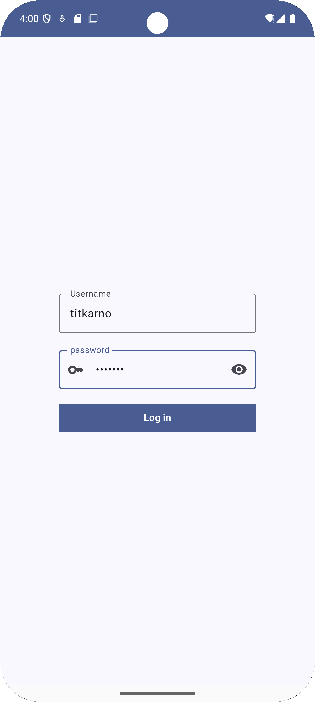
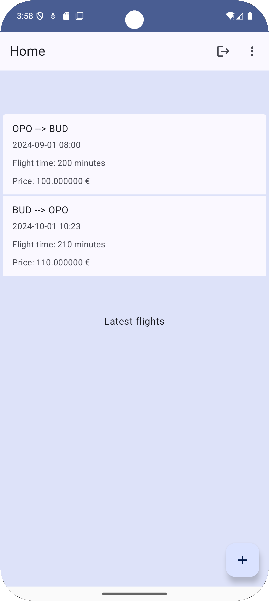
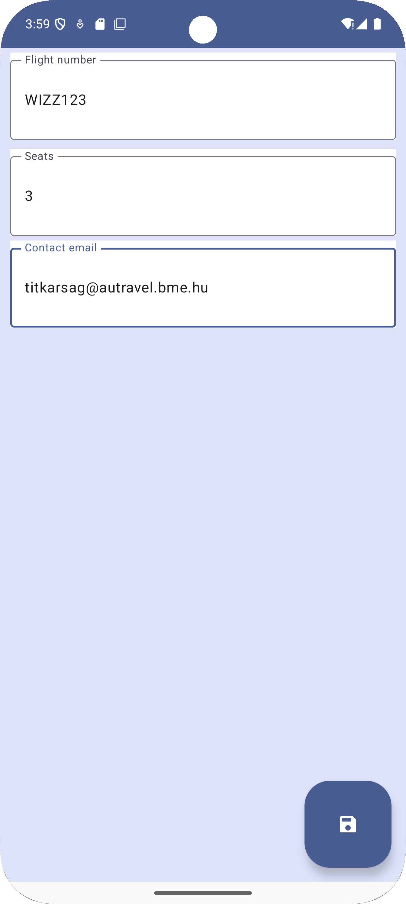

# Labor 3 - Travel

A harmadik laborban egy utazási iroda applikációját fejlesztjük ki, amelyet az utazási iroda munkatársai használnak.
Az utazási iroda az ügyfeleinek több dolgot elvégez, és ehhez változatos technológiák használatára van szükség.
Az alkalmazás funkciói az alábbiak lesznek:

* Listázza az elérhető járatokat, amelyekre jelenleg lehet foglalni. A járatok listáját egy WebSocket API-n keresztül
éri el. Itt történik az indulás utáni első lekédezés, és a futás közben megjelent új ajánlatok letöltése is.
* Amikor foglalni szükséges, a foglalást az iroda egy aszinkron üzenetsorba küldi MQTT protokollon keresztül.
* Előfordul, hogy az irodát felhívják az ügyfelek, és információkat kérnek az egyes úticélokról. Ehhez az iroda egy
publikus GraphQL API-n keresztül kérdez le információkat az adott országról.
* Bizonyos későbbi funkciókhoz az iroda munkatársainak be kell jelentkezniük az alkalmazásba. Ezt egy hagyományos REST 
hívással lehet elvégezni, amely egy hozzáférési tokent ad vissza. Szeretnénk ezt viszont az alkalmazásban a best
practice-ek szerint biztonságosan tárolni.

A feladat során az alábbi technológiákkal fogunk találkozni:

*   Modern App Architecture
*   WebSocket
*   MQTT
*   GraphQL
*   Biometrikus azonosítás

Az alkalmazásban mindössze négy lényeges felület lesz. Kezdetben egy login képernyő fogad, amely a projektvázban bármilyen
felhasználónév-jelszó párosra beenged. A főképernyőn a járatok láthatóak. A menüből navigálhatunk a
másik két képernyőre. Az egyiken foglalást lehet végezni, a másikon az országok adatai böngészhetők. Az utóbbit kivéve
a képernyők már elő vannak készítve a projektvázban:

<p align="center">



</p>

!!!info "Pontozás"
    Ebben a laborban két "vezetett" (= teljesen dokumentált) és négy önálló feladat is van. A négy önálló feladatból csak az
    utolsó épül az előtte levőre, a többiből tetszőleges összeállításban megszerezheted a maximális 3 pontot.

## Előkészületek

A feladatok megoldása során ne felejtsd el követni a [feladat beadása folyamatát](../../tudnivalok/github/GitHub).

### Git repository létrehozása és letöltése

1. Moodle-ben keresd meg a laborhoz tartozó meghívó URL-jét és annak segítségével hozd létre a saját repository-dat.

1. Várd meg, míg elkészül a repository, majd checkout-old ki.

    !!! tip ""
        Egyetemi laborokban, ha a checkout során nem kér a rendszer felhasználónevet és jelszót, és nem sikerül a checkout, akkor valószínűleg a gépen korábban megjegyzett felhasználónévvel próbálkozott a rendszer. Először töröld ki a mentett belépési adatokat (lásd [itt](../../tudnivalok/github/GitHub-credentials.md)), és próbáld újra.

1. Hozz létre egy új ágat `megoldas` néven, és ezen az ágon dolgozz.

1. A `neptun.txt` fájlba írd bele a Neptun kódodat. A fájlban semmi más ne szerepeljen, csak egyetlen sorban a Neptun kód 6 karaktere.

## Projekt megnyitása

Az alkalmazás váza már adott a `Travel` könyvtárban. Nyissuk meg a könyvtárat az Android Studióval.

### Első feladat: az alkalmazás áttekintése, a backend indítása, járatok listázása

Tekintsük át az alkalmazás kódját! Az alkalmazás a Modern App Architecture elvek szerint készült, de még fix listát ad
vissza a járatokról. Ezt fogjuk majd módosítani olyan módon, hogy egy WebSocket csatornára kapcsolódunk, ahol kapcsolódás
után megkapjuk az eddigi járatok listáját, illetve a kapcsolódástól kezdve mindig frissítést kapunk, ha új járatot
írtak ki.

A backend a feladat repository-jában, a `travel-backend` könyvtárban található, és többféleképpen indítható. Ha Docker
nélkül indítjuk, akkor JDK 17 vagy újabb szükséges hozzá. A backend egy gradle projekt, és gradle wrappert is tartalmaz,
így a könyvtárban parancssorral könnyen indítható.

Windowson:

```.\gradlew.bat bootRun```

Linuxon és Macen:

```./gradlew bootRun```

Vagy ha ismerős számunkra a Docker, akkor a projekt gyökerében elhelyezett `Dockerfile` segítségével készíthetünk egy
image-et, amit futtatva elindul a backend. Ha így indítod, ügyelj rá, hogy a 8080-as belső portot mappeld a hosztgép
8080-as portjára!

Végezetül egy harmadik lehetőség, hogy ha ismerős számunkra a Java (Kotlin) alapú backendfejlesztés, akkor a projektet
egy fejlesztőkörnyezetben (IntelliJ, Eclipse, VS Code) megnyitva is futtathatjuk a projektet.

Az új ajánlatok érkezését (és ezáltal a WebSocketen új üzenet küldését) a backend egy adott végpontjával válthatjuk ki.
A `http://localhost:8080/api/offers` végpontra szükséges egy POST üzenetet küldenünk JSON formátumban, pl. az alábbi
tartalommal:

```json
{
    "flightNumber": "WIZZ987",
    "from": "BUD",
    "to": "LIS",
    "departure": "2024-11-10T08:30",
    "durationMinutes": 170,
    "priceEur": 95
}
```

Ez a felküldés nem része az Androidos alkalmazás funkcióinak, de ezt elvégezheted az előző laboron megismert `Swagger UI`
felülettel, amely az OpenAPI leírással együtt most is generálódik. Vagy ha ismered, használhatod a Postman alkalmazást is.
Egy új járat felvétele után a backend konzoljában tudod ellenőrizni, hogy beérkezett a backendhez az ajánlat.

A megoldáshoz a `kotlinx-serialization` technológiát is használni fogjuk, ez kódgeneráláson alapul, ezért egy Gradle
plugin is szükséges hozzá. Ezért először a projektszintű `build.gradle.kts` fájlba vegyük fel a szükséges plugint:

```kotlin
id("org.jetbrains.kotlin.plugin.serialization") version "2.0.20" apply false
```

Majd alkalmazzuk a modulszintű `build.gradle.kts` fájlunkban:

```kotlin
plugins {
    // ...

    id("org.jetbrains.kotlin.plugin.serialization")
}
```

És vegyük fel a szükséges függőségeket is, majd szinkronizáljuk a projektet:

```kotlin
// WebSocket
implementation("io.ktor:ktor-client-okhttp:2.3.11")
implementation("io.ktor:ktor-client-websockets:2.3.11")
implementation("io.ktor:ktor-client-content-negotiation:2.3.11")
implementation("io.ktor:ktor-client-core:2.3.11")
implementation("io.ktor:ktor-serialization-kotlinx-json:2.3.11")
```

Az alkalmazásunknak az `INTERNET` engedélyre van szüksége, illetve engedélyeznie kell, hogy SSL nélküli hálózati
kapcsolatot használjunk. Ezek a beállítások a Manifestben már el vannak végezve.

Készítsünk a `datasource` package-en belül egy `util` package-et, és oda vegyük fel az alábbi segédosztályt:

```kotlin
package hu.bme.aut.android.travel.data.datasource.util;

import io.ktor.client.HttpClient
import io.ktor.client.engine.okhttp.OkHttp
import io.ktor.client.plugins.contentnegotiation.ContentNegotiation
import io.ktor.client.plugins.websocket.WebSockets
import io.ktor.serialization.kotlinx.KotlinxWebsocketSerializationConverter
import io.ktor.serialization.kotlinx.json.json
import kotlinx.serialization.json.Json

object KtorClient {
    val httpClient: HttpClient = HttpClient(OkHttp) {
        install(WebSockets) {
            pingInterval = 5_000
            contentConverter = KotlinxWebsocketSerializationConverter(Json)
        }

        install(ContentNegotiation) {
            json(
                Json {
                    prettyPrint = true
                    isLenient = true
                }
            )
        }
    }
}
```

Ezután a `FlightRepository` interfészünkhöz készítünk egy alternatív implementációt, amely a WebSocket kapcsolaton
keresztül fogadja az adatokat:

```kotlin
package hu.bme.aut.android.travel.data.datasource

import android.util.Log
import hu.bme.aut.android.travel.data.datasource.util.KtorClient
import hu.bme.aut.android.travel.data.entities.FlightEntity
import io.ktor.client.plugins.websocket.webSocketSession
import io.ktor.http.URLProtocol
import io.ktor.http.path
import io.ktor.websocket.Frame
import io.ktor.websocket.readText
import kotlinx.coroutines.Dispatchers
import kotlinx.coroutines.flow.Flow
import kotlinx.coroutines.flow.catch
import kotlinx.coroutines.flow.map
import kotlinx.coroutines.flow.receiveAsFlow
import kotlinx.coroutines.withContext
import kotlinx.serialization.json.Json

class FlightRepositoryWebSocketImpl : FlightRepository {
    companion object {
        const val TAG = "WEBSOCKET"
    }

    private lateinit var state: Flow<List<FlightEntity>>

    override suspend fun getAllFlights(): Flow<List<FlightEntity>> = withContext(Dispatchers.IO) {
        val socket = KtorClient.httpClient.webSocketSession {
            url {
                it.protocol = URLProtocol.WS
                it.host = "10.0.2.2"
                it.port = 8080
                it.path("/offers")
            }
        }

        socket
            .incoming
            .receiveAsFlow()
            .map { frame ->
                if (frame is Frame.Text) frame.readText() else ""
            }
            .also {
                Log.d(TAG, "Received data: $it")
            }
            .map {
                val data = Json.decodeFromString<List<FlightEntity>>(it)
                data
            }
            .catch { error ->
                Log.d(TAG, "Error: $error")
                throw error
            }
    }
}
```

Most módosítsuk a dependency injection beállításait, hogy immár ezt az implementációt használjuk:

```kotlin
@Module
@InstallIn(SingletonComponent::class)
object RepositoryModule {

    @Provides
    @Singleton
    fun provideFlightRepository(): FlightRepository = FlightRepositoryWebSocketImpl()
}
```

!!!info "Modern App Architecture"
    Valójában a logikát egy DataSource komponensbe kellene szerveznünk a Modern App Architecture szerint, és a Repository
    ennek a műveleteit ajánlaná ki aszinkron módon a felsőbb rétegeknek, de jelen esetben ez a szétválasztás kevés előnnyel
    járna, ezért az egyszerűségre törekvés jegyében csak egy Repository komponensben valósítottuk meg a funkciókat.

Még egy lépés maradt hátra: a `FlightEntity` osztályon helyezzük el a `kotlinx-serialization` működéséhez szükséges
`@Serializable` annotációt:

```kotlin
@Serializable
data class FlightEntity(
    val flightNumber: String,
    val from: String,
    val to: String,
    val departure: LocalDateTime,
    val durationMinutes: Int,
    val priceEur: Double
)
```

Most már futtathatjuk az alkalmazást, de előtte hozzunk létre 1-2 járatot, hogy megfigyeljük, hogy induláskor tényleg
betöltődik a kezdeti lista. A login képernyő egyelőre bármilyen adatokat elfogad, annak egy későbbi feladatrészben
lesz csak jelentősége. Vigyünk fel REST-hívással egy újabb járatot, amikor a főképernyő látható! Ennek most meg kell
jelennie a listában is.

Figyeld meg, hogyan alkalmazzuk a modern architektúrában a `Flow`-kat! A `BookingUseCase`-ben található `collect`
hívástól eltekintve a frissítések kezelése teljesen transzparens.

!!!example "BEADANDÓ (1 pont)"
    Készíts képernyőképet (f1.png) róla, hogy fut az alkalmazás, és benne megjelennek az általad felvitt járatok is.

### Második feladat: Foglalás MQTT segítségével

A második feladathoz szükségünk lesz egy MQTT protokollt támogató message brókerre. Ehhez itt a `Mosquitto` brókert
fogjuk használni. Ez legkönnyebben Docker segítségével indítható az alábbi módon.

Először egy konfigurációs fájlt kell létrehoznunk a számára egy tetszőleges könyvtárban, ennek a neve legyen
`mosquitto.conf`, tartalma:

```
allow_anonymous true
listener 1883
protocol mqtt
```

Most állapítsunk meg, hogy mi a teljes abszolút útvonala a fent létrehozott fájlnak, pl.
`C:\Users\Pistike\mosquitto.conf`, mert az alábbi parancssorban teljes útvonalával kell majd beírjuk. És ennek az
útvonalnak az ismeretében adjuk ki az alábbi parancsot:

```
docker run --name mosquitto -it -p 1883:1883 -p 9001:9001 -v <ÚTVONAL>\mosquitto.conf:/mosquitto/config/mo
squitto.conf eclipse-mosquitto
```

Ha másképp indítod, pl Docker Desktoppal vagy kézileg telepítve, ügyelj rá, hogy az emulátort futtató hosztgép
1883-as portján elérhető legyen, és hogy a konfigurációs fájl mappelése a konténerbe megtörténjen.

A fenti parancsra letöltődik, és elindul a `Mosquitto` jelenlegi aktuális verziója, és a háttérben fog futni.
Most adjuk ki az alábbi parancsot, ezzel a futó konténerben tudunk egy parancssort indítani:

```
docker exec -it mosquitto /bin/sh
```

Látjuk, hogy egy `/ #` formátumú prompt jelzi, hogy a konténer gyökerében vagyunk. Itt, a belső parancssorban adjuk ki
a következő parancsot:

```
mosquitto_sub -h localhost -t bookings
```

Ezzel feliratkoztunk a `bookings` nevű üzenetsorra, és itt a konzolon látni fogjuk, ha az alkalmazásunk sikeresen
beküld egy foglalást.

Most már elkezdhetünk dolgozni az alkalmazással. A projektvázban egy placeholder `BookingRepositoryImpl` osztály
van bekötve, ez csak loggolja a foglalásokat, és a Logcat nézetben megtekinthetőek. Ehelyett készítjük el az MQTT
alapú implementációt.

Kezdetben vegyük fel a szükséges új függőségeket a `build.gradle.kts` fájlunkba:

```kotlin
// MQTT
implementation("com.github.hannesa2:paho.mqtt.android:4.3.beta4")
implementation("androidx.legacy:legacy-support-v4:1.0.0")
```

Mivel a `Paho` könyvtár olyan verzióját használjuk, amely nincs fent a Google repository-jában, ezért a
`settings.gradle.kts` fájlban is frissítenünk kell a repository-listát:

```kotlin
dependencyResolutionManagement {
    repositoriesMode.set(RepositoriesMode.FAIL_ON_PROJECT_REPOS)
    repositories {
        google()
        mavenCentral()
        maven {
            setUrl("https://jitpack.io")
        }
    }
}
```

Majd néhány szükséges engedélyt a `Manifest` fájlba. Ezek a használt könyvtárnak szükségesek:

```xml
<uses-permission android:name="android.permission.WAKE_LOCK" />
<uses-permission android:name="android.permission.ACCESS_NETWORK_STATE" />
```

Most létrehozzuk az új repository-nkat `BookingRepositoryMqttImpl` néven:

```kotlin
package hu.bme.aut.android.travel.data.datasource

import android.content.Context
import android.util.Log
import info.mqtt.android.service.MqttAndroidClient
import org.eclipse.paho.client.mqttv3.IMqttActionListener
import org.eclipse.paho.client.mqttv3.IMqttDeliveryToken
import org.eclipse.paho.client.mqttv3.IMqttToken
import org.eclipse.paho.client.mqttv3.MqttCallback
import org.eclipse.paho.client.mqttv3.MqttMessage

class BookingRepositoryMqttImpl(val context: Context) : BookingRepository {
    companion object {
        const val TAG = "BOOKING"
        const val URI = "tcp://10.0.2.2:1883"
        const val CLIENT_ID = "TravelApp"
        const val TOPIC = "bookings"
    }

    suspend override fun sendBooking(
        flightNumber: String,
        seats: Int,
        contactEmail: String
    ) {
        val mqttClient = MqttAndroidClient(context, URI, CLIENT_ID)
        mqttClient.setCallback(object : MqttCallback {
            override fun connectionLost(cause: Throwable?) {
                Log.d(TAG, "Error: ${cause?.message}")
            }

            override fun messageArrived(
                topic: String?,
                message: MqttMessage?
            ) {
                Log.d(TAG, "Message arrived: ${message.toString()}")
            }

            override fun deliveryComplete(token: IMqttDeliveryToken?) {
                Log.d(TAG, "Delivery successful")
                // Only sending one message per connection
                mqttClient.disconnect()
            }

        })

        mqttClient.connect(null, object : IMqttActionListener {
            override fun onSuccess(asyncActionToken: IMqttToken?) {
                Log.d(TAG, "Successful connection")

                val payload = "$flightNumber;$seats;$contactEmail"
                val message = MqttMessage(payload.toByteArray(Charsets.UTF_8))
                mqttClient.publish(TOPIC, message)
            }

            override fun onFailure(
                asyncActionToken: IMqttToken?,
                exception: Throwable?
            ) {
                Log.d(TAG, "Connection failed: $exception")
            }
        })
    }
}
```

A fenti kódban az alábbiakat figyelhetjük meg:

* A klienskönyvtár callbackek segítségével működik, és ezeket két részletben kell megadunk. Bizonyos eseményekre
már a kliens létrehozásakor feliratkozunk, de a kapcsolat sikeres vagy sikertelen felépítésére csak a kapcsolódáskor.
* Jelenleg csak egy üzenetet küldünk be, majd bontjuk is a kapcsolatot. Viszont az üzenetküldés aszinkron, így nem
lehet egyből az `mqttClient.publish(TOPIC, message)` sor után bontani a kapcsolatot, mert akkor nem lesz ideje a
küldésnek lefutnia. Ezért a kapcsolatot a `deliveryComplete()` callbackben bontjuk, ettől viszont a kód kicsit
széttagolt lesz.
* A kapcsolatot fent lehetne tartani, és fogadhatnánk is üzeneteket az üzenetsoron keresztül, akár különböző topic-okra
feliratkozva, és különböző topic-okba publikálva. De ezt a funkcionalitást ebben az alkalmazásban most nem használjuk ki.
* Jelenleg a repository-t hívó viewmodel nem kap értesítést a művelet sikerességéről vagy sikertelenségéről, és a
repository meghívása után mindenképp hibaüzenet nélkül visszanavigál a főképernyőre, ezzel mindig azt sugallva, hogy a
művelet sikeres, akkor is ha valójában nem az.
* Az üzenet tetszőleges tartalmú lehet, most CSV-ben küldjük szövegesen az adatot.

!!!info "Modern App Architecture"
    Ahogyan az előző feladatrészben, most is valójában egy DataSource komponensbe kellene szerveznünk a logikát, ha
    pontosan követni akarjuk a legújabb architekturális ajánlásokat.

Már csak az maradt hátra, hogy a korábbi dummy repository osztályt lecseréljük, ehhez a dependency injection beállításait
kell módosítanunk:

```kotlin
@Module
@InstallIn(SingletonComponent::class)
object RepositoryModule {

    @Provides
    @Singleton
    fun provideFlightRepository(): FlightRepository = FlightRepositoryWebSocketImpl()

    @Provides
    @Singleton
    fun provideBookingRepository(@ApplicationContext context: Context): BookingRepository =
        BookingRepositoryMqttImpl(context)
}
```

Most az alkalmazást kipróbálva a beküldésnek már működnie kell, ezt a Logcat nézetben, illetve a konzolban indított
parancssoros feliratkozással is tudjuk ellenőrizni.

!!!example "BEADANDÓ (1 pont)"
    Készíts képernyőképet (f2.png) a kapcsolódó kódrészletről, benne kommentként a Neptun-kódoddal, mellette a 
    konzolos képernyő, ahol látszik a beküldött üzenet.

### Harmadik feladat: Hibakezelés

Ahogy az előző feladatrészben említettük, az elkészült megoldás nem teljes, mert a hibakezeléssel nem foglakoztunk.
A hibakezelés kérdése átgondolást igényel, mivel a repository rögtön visszatér, de a publikálás valójában
aszinkron módon történik. Gondold át ezt a problémakört! Milyen megoldást tudsz alkalmazni erre a problémára, amely
megfelel a modern architekturális ajánlásoknak is? Gondolkodj el rajta, mielőtt megnézed a segítséget!

???info "Segítség"
    A blokkoló hívások a performancia szempontjából nem jók, ezért az semmiképpen sem elfogadható, ha valamilyen módon
    bevárjuk az eredményt, és a repository csak akkor tér vissza. A működésnek aszinkronnak kell maradnia.
    A modern architekturális ajánlások szerint az aszinkron adatokat kétféleképpen érdemes kezelni. A folyamatosan frissülő
    (eseményfolyam jellegű) adatokat Flow-k formájában javasolt kezelni, az egyszerieket egyszerű suspending függvényekként.
    Mivel egy foglalás beküldésének kimenetele egyszeri eredmény, ezért az utóbbi a legalkalmasabb megoldás. A repository
    látszólag akkor térjen vissza, amikor tényleg befejeződött a művelet, de suspending függvényként ne blokkolja az
    alkalmazás UI szálát. Ha pedig hiba történik, dobhat kivételt. A kérdés már csak az, hogyan lehet ezt implementálni?
    A függvény törzsének végén tudunk egy ciklusban várakozni egy flagre, amit az MQTT könyvtár callbackje állít be, és
    ahol jelzi, ha sikeresen vagy sikertelenül lefutott a beküldés. Viszont a várakozás közben időről-időre el kell altatnunk
    a szálat, hogy ne legyen blokkoló más komponensek számára. A Kotlin `delay()` függvénye lehet ebben a segítségünkre.

    ```kotlin
        override suspend fun sendBooking(
        flightNumber: String,
        seats: Int,
        contactEmail: String
    ) {
        
        data class Result(
            var done: Boolean = false,
            var ex: Throwable? = null)
        
        val result = Result()
        
        // ...
        
        while (!result.done) {
            delay(500)
        }

        if (result.ex != null)
            throw result.ex!!
    }
    ```

Ha elkészültél az implementációval, teszteld a sikeres és a sikertelen esetet is! A sikertelen eset tesztelésére
ideiglenesen módosíthatod a kódot, hogy fixen hibát adjon a küldés.

!!!example "BEADANDÓ (1 pont)"
    Készíts képernyőképet (f3.png) a kapcsolódó kódrészletről, benne kommentként a Neptun-kódoddal, mellette a
    futó alkalmazás a hibajelzéssel

### Negyedik feladat: Országinfók lekérdezése

Készíts egy új képernyőt, ahol egy GraphQL adatbázisban elérhető információk alapján megjeleníted az országokat az
alapvető jellemzőikkel!

Itt találsz a feladathoz egy publikusan elérhető GraphQL API-t:
https://github.com/trevorblades/countries

Ezt az API-t ezen az online felületen ki is tudod próbálni:
https://countries.trevorblades.com/

Használhatod ezt a query-t a lekérdezéshez:

```
query Countries {
  countries {
    name
    capital
    currency
    languages {
      name
    }
  } 
```

Most a GraphQL API használatán van a hangsúly, a képernyőnek nem szükséges bonyolultnak lennie, lehet egy egyszerű
`ListItem` alapú lista a járatok listájához hasonlóan. A menürendszer már elő van készítve a funkcióra, csak a megfelelő
helyen meg kell hívnod az új Screent composable függvényként.

Mintaként használd az előadás diáit és az előadáson bemutatott példaprogramot:
https://github.com/VIAUBXAV080/EA/tree/main/06

!!!example "BEADANDÓ (1 pont)"
    Készíts képernyőképet (f4.png) az országok listájáról, ahol látszódnak a megjelenített jellemzők is.

### Ötödik feladat: Authentikáció

Az alkalmazás login képernyője ezidáig bármit elfogadott, viszont a backend implementálja a bejelentkezést. Alakítsd át
úgy az alkalmazást, hogy ténylegesen a backend hívásával végezze a bejelentkezést.

Nem feladat az alkalmazásban a regisztráció megvalósítása, de a bejelentkezéshez először egy felhasználót kell
létrehoznod. A backendben ehhez is készült egy végpont, ezt meghívhatod a már megismert Swagger UI-jal vagy a
Postmannel is. Nézd meg a hívás pontos módját a generált API-leírásban!

Ha regisztráltál felhasználót, akkor már használhatod a bejelentkezéshez is. A bejelentkezéshez is egy REST végpontot
kell hívnod. Ez a sikeres bejelentkezést 200 OK státuszkóddal és egy törzsben visszaadott tokennel jelzi. Ha sikertelen
a bejelentkezés, akkor 401 UNAUTHORIZED választ kapsz.

Módosítsd úgy az alkalmazást, hogy a login képernyő ezt a végpontot használja, és csak akkor továbbítson a főképernyőre,
ha sikeres volt a bejelentkezés. A backend hívását "kézzel" is elvégezheted, de akár használhatod a korábban megismert
OpenAPI alapú kódgenerálást is!

Ebben a feladatrészben a visszaadott tokent még bárhogyan tárolhatod (pl. Application osztály companion objectjében),
a biztonságossá tétele majd a következő feladatrészben valósul meg.

A backendben a `/api/users/me` endpoint hívható úgy, hogy a tokent az `Authorization` headerben küldöd, és ez visszaadja
a tokenhez tartozó felhasználó nevét. Jeleníts meg ez alapján egy személyre szabott üdvözlést a főképernyő tetején.

!!!example "BEADANDÓ (1 pont)"
    Készíts képernyőképet (f5.png) a kapcsolódó kódrészletről, benne kommentként a Neptun-kódoddal,
    mellette a backend logja a sikeres bejelentkezésről és a telefon főképernyője az üdvözlő szöveggel.

### Hatodik feladat: Token biztonságos tárolása

Egy egyszerre kényelmesen és biztonságosan működő alkalmazás a backendtől kapott hozzáférési tokent titkosítva tárolná
el, és az újbóli megnyitások alkalmával - amikor már van letárolt token - a felhasználót biometrikusan vagy
képernyőmintával, esetleg PIN-kóddal azonosítaná. Ebben a feladatrészben ezt kell megvalósítani.

Az alábbi cikkben részletesen ismertetik a szükséges lépéseket:
https://medium.com/@ostorlab/introduction-d481bcc774c8

!!!example "BEADANDÓ (1 pont)"
    Készíts képernyőképet (f6.png) a kapcsolódó kódrészletről, benne kommentként a Neptun-kódoddal, mellette a
    futó alkalmazás az ujjlenyomat-azonosítást kérő dialógussal.